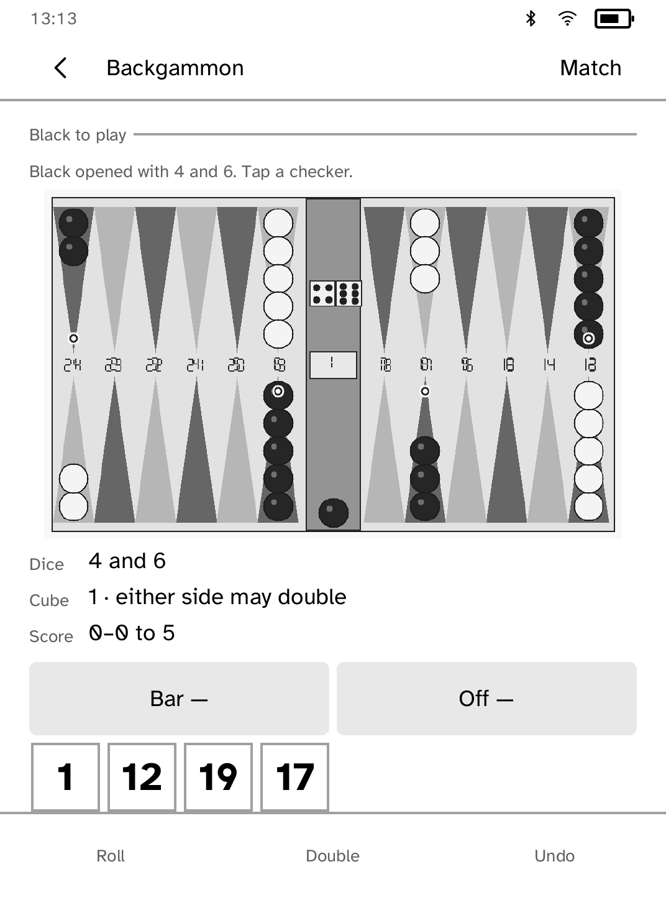
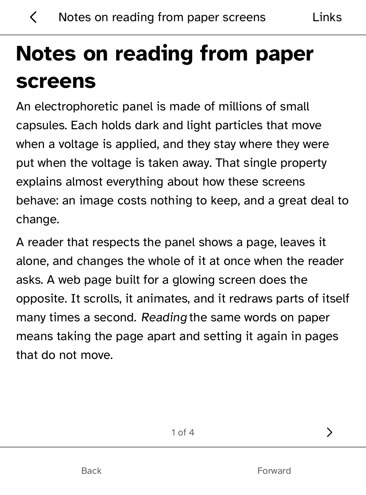
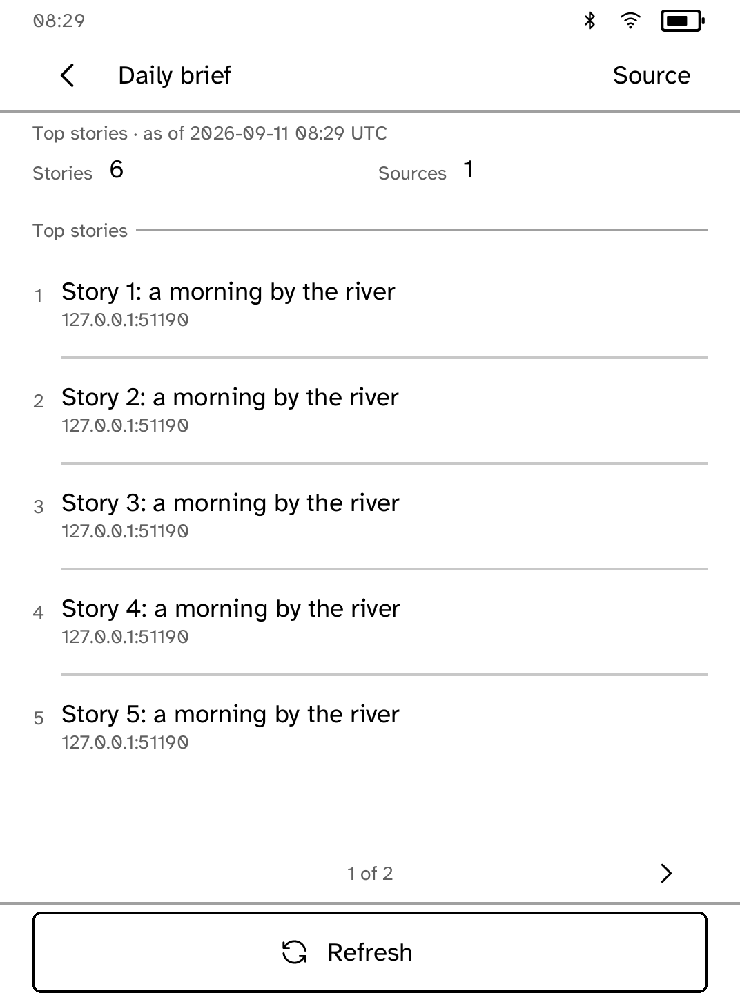
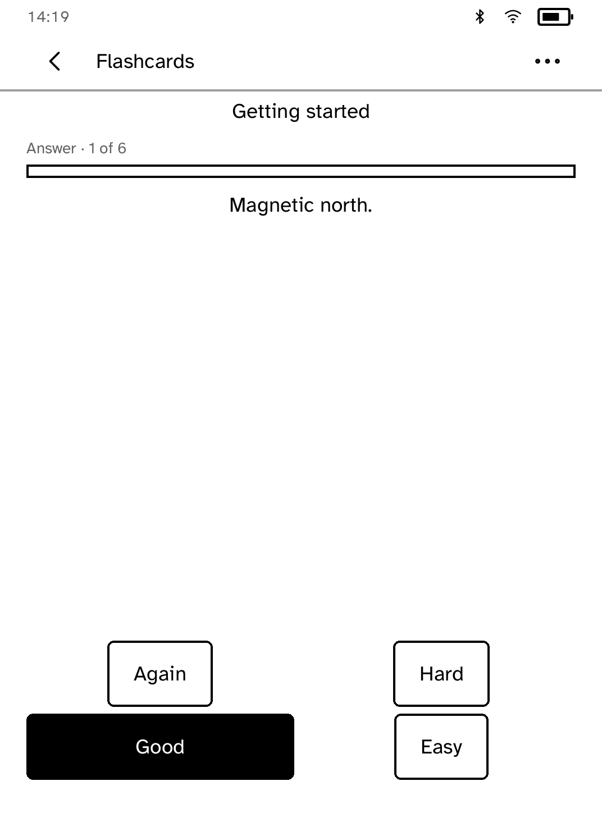
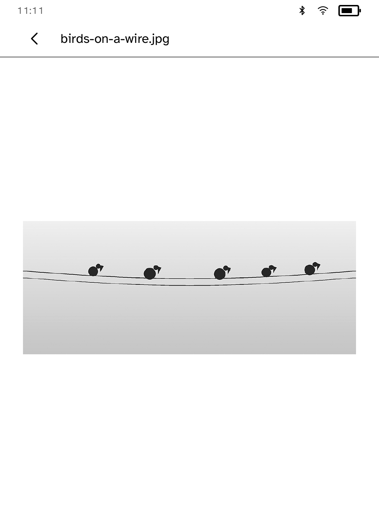
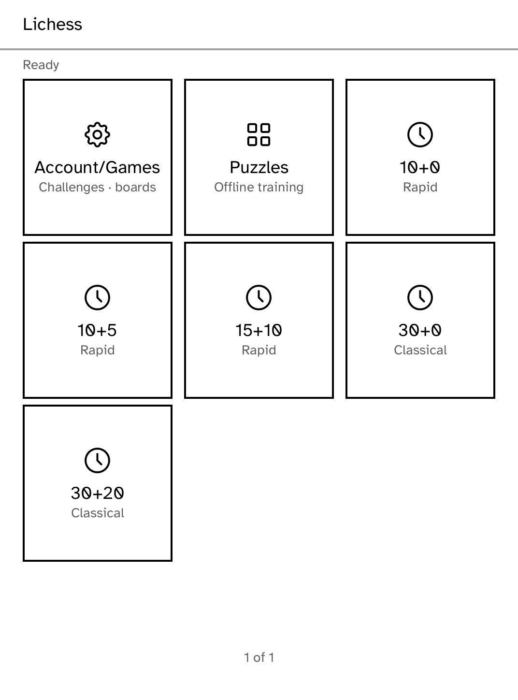
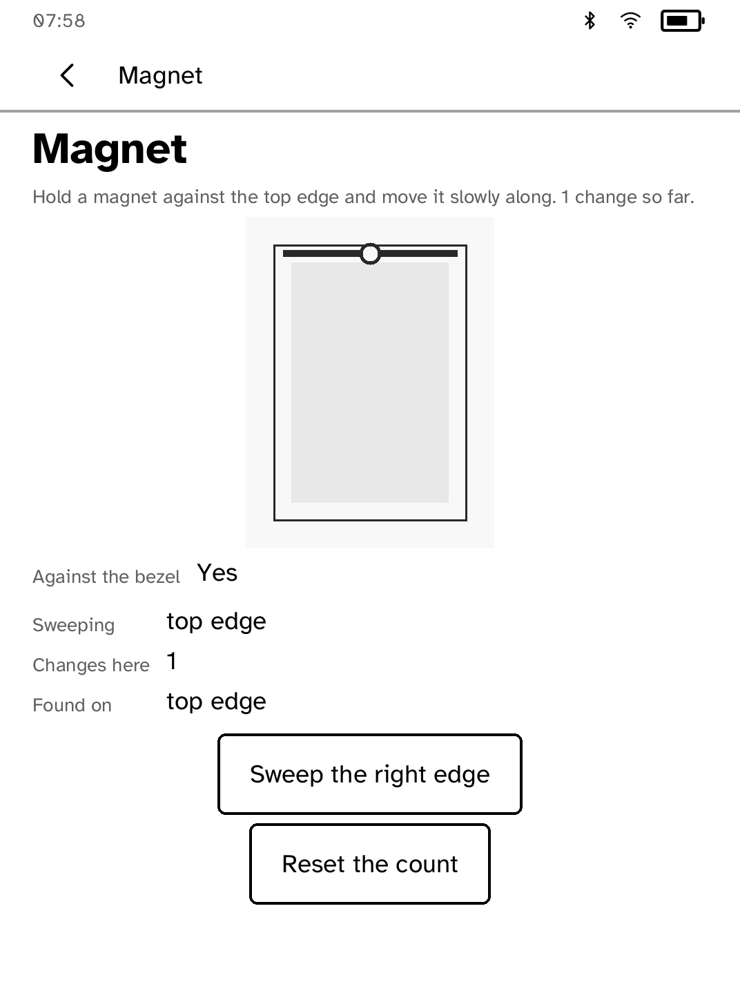
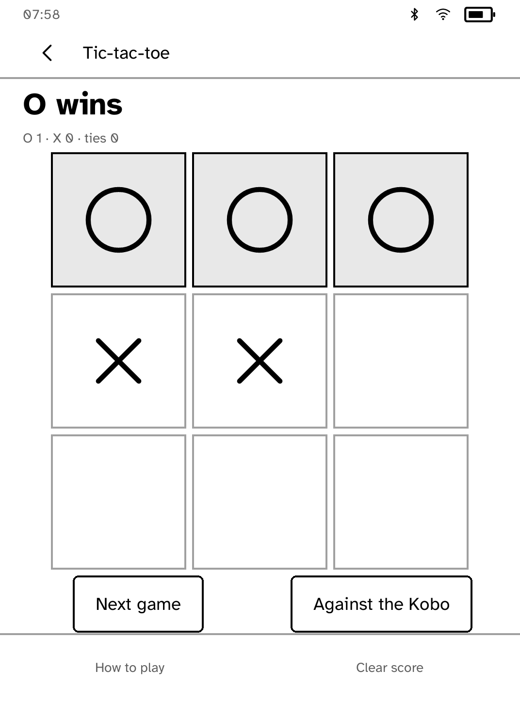
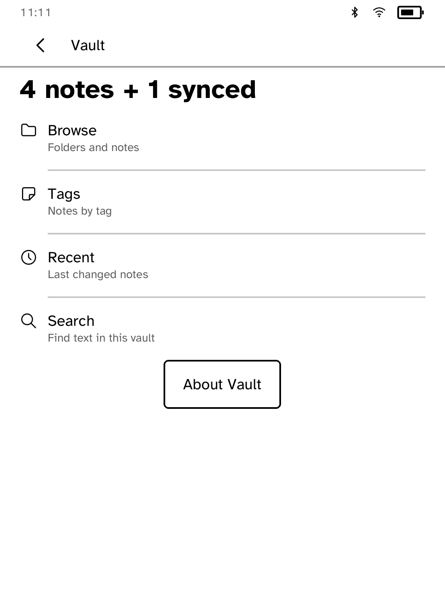

<p align="center">
  
</p>

<p align="center"><strong>Apps and an SDK for Kobo e-readers.</strong></p>

<p align="center">
  <a href="https://github.com/BandarLabs/Cobalt/actions/workflows/ci.yml"></a>
  <a href="https://github.com/BandarLabs/Cobalt/actions/workflows/apps.yml"></a>
  <a href="https://github.com/BandarLabs/Cobalt/releases/latest"></a>
  <a href="LICENSE"></a>
</p>

Cobalt adds apps to Kobo e-readers. It includes a launcher, an app store, a
Rust SDK, a runtime that runs each app in its own restricted process, and a
simulator for building apps without a device.

Install Cobalt once over USB. After that, apps install, update and uninstall
over Wi-Fi, and your Kobo's own reader stays as it was.

<p align="center">
  <a href="https://bandarlabs.github.io/Cobalt/">Website</a> ·
  <a href="https://bandarlabs.github.io/Cobalt/install/">Install</a> ·
  <a href="https://bandarlabs.github.io/Cobalt/#apps">Apps</a> ·
  <a href="https://bandarlabs.github.io/Cobalt/sdk.html">SDK</a> ·
  <a href="https://www.reddit.com/r/CobaltForKobo/">Community</a>
</p>

<p align="center">
  <a href="docs/cobalt-tour.mp4">
    
  </a><br>
  <sub>Recorded on a Kobo Clara BW at 3× speed.</sub>
</p>

> [!IMPORTANT]
> Tested on the Kobo Clara BW (N365 and the 2025 P365), Clara Colour, Clara HD,
> Elipsa 2E, Libra 2, Libra Colour and Libra H2O, at the firmware listed in the
> [device support matrix](docs/DEVICES.md#device-support-matrix). Other Kobos
> can run it too: Cobalt lists what has not been tested and asks once before
> it starts. Kobo firmware 5.x is not supported. Cobalt is not affiliated with
> Rakuten Kobo.

## Install

The easiest way is the [browser installer](https://bandarlabs.github.io/Cobalt/install/),
in Chrome, Edge or Opera. Plug in your Kobo and follow the steps.

Or, on macOS or Linux:

```sh
curl -fsSL https://bandarlabs.github.io/Cobalt/install.sh | sh
```

Then restart the reader, wait a minute, and open **Cobalt** from the Kobo menu.
If you already use NickelMenu, Cobalt is added to it and your other entries
are kept.

Everything the script downloads is checked against the signed release
manifest. To verify `install.sh` itself first, follow the
[signed-bootstrap procedure](docs/INSTALL.md#signed-bootstrap).
[docs/INSTALL.md](docs/INSTALL.md) covers updates, recovery, uninstalling and
building from source.

### Updates

- **Cobalt** updates from **Settings** on the reader. Settings also switches
  between the Stable and Beta channels, keeping your apps and data.
- **Apps** update from **Store**.
- **The `kobo` command** on your computer updates with `kobo update`, or
  `kobo update --channel beta`. This never changes the reader.

## Apps

Install and remove apps from **Store** on the reader, or from an app's page on
the website: open **Install links** in Store to link a phone or computer, then
use **Install** on any [app page](https://bandarlabs.github.io/Cobalt/#apps).
The Launcher, Store, Settings and Terminal come with Cobalt and cannot be
removed.

Screenshots are from a Kobo Clara BW or its simulator.

<!-- store-apps:start -->
<table>
<tr>
<td width="33%" valign="top"><a href="apps/chat/README.md"></a><br><b><a href="apps/chat/README.md">AI Command Center</a></b><br>Ask a question, then read and navigate the answer with touch controls.</td>
<td width="33%" valign="top"><a href="apps/audiobook/README.md"></a><br><b><a href="apps/audiobook/README.md">Audiobook Studio</a></b><br>Turn a topic into an original narrated audiobook and listen on your Kobo.</td>
<td width="33%" valign="top"><a href="apps/backgammon/README.md"></a><br><b><a href="apps/backgammon/README.md">Backgammon</a></b><br>Play complete solo or pass-and-play backgammon on one Kobo.</td>
</tr>
<tr>
<td width="33%" valign="top"><a href="apps/birds/README.md"></a><br><b><a href="apps/birds/README.md">Birds</a></b><br>Show the birds heard by BirdNET-Go on your Mac or Linux computer.</td>
<td width="33%" valign="top"><a href="apps/browser/README.md"></a><br><b><a href="apps/browser/README.md">Browse</a></b><br>Read web pages as pages you turn.</td>
<td width="33%" valign="top"><a href="apps/gallery/README.md"></a><br><b><a href="apps/gallery/README.md">Components</a></b><br>See every Cobalt UI component on the device in one reference app.</td>
</tr>
<tr>
<td width="33%" valign="top"><a href="apps/crossword/README.md"></a><br><b><a href="apps/crossword/README.md">Crossword</a></b><br>Four offline mini crosswords with clue navigation and saved progress.</td>
<td width="33%" valign="top"><a href="apps/brief/README.md"></a><br><b><a href="apps/brief/README.md">Daily Brief</a></b><br>Build a daily news brief in the background while you use other apps.</td>
<td width="33%" valign="top"><a href="apps/deck/README.md"></a><br><b><a href="apps/deck/README.md">Deck</a></b><br>Turn your Kobo into a remote control for your computer.</td>
</tr>
<tr>
<td width="33%" valign="top"><a href="apps/rss-miniflux/README.md"></a><br><b><a href="apps/rss-miniflux/README.md">Digest</a></b><br>Read your Miniflux feeds anywhere.</td>
<td width="33%" valign="top"><a href="apps/fanshelf/README.md"></a><br><b><a href="apps/fanshelf/README.md">Fanshelf</a></b><br>Save public AO3 works to a shelf made for offline reading.</td>
<td width="33%" valign="top"><a href="apps/rss/README.md"></a><br><b><a href="apps/rss/README.md">Feeds</a></b><br>Follow feeds, search saved articles and read offline with images.</td>
</tr>
<tr>
<td width="33%" valign="top"><a href="apps/fieldbook/README.md"></a><br><b><a href="apps/fieldbook/README.md">Fieldbook</a></b><br>Log bird sightings anywhere and build your life list.</td>
<td width="33%" valign="top"><a href="apps/flashcards/README.md"></a><br><b><a href="apps/flashcards/README.md">Flashcards</a></b><br>Review flashcards anywhere, even without Wi-Fi.</td>
<td width="33%" valign="top"><a href="apps/frame/README.md"></a><br><b><a href="apps/frame/README.md">Frame</a></b><br>Show photos from your computer as a slideshow, with the screen on or waking on a schedule.</td>
</tr>
<tr>
<td width="33%" valign="top"><a href="apps/grimoire/README.md"></a><br><b><a href="apps/grimoire/README.md">Grimoire</a></b><br>Browse offline SRD references and manage tabletop combat.</td>
<td width="33%" valign="top"><a href="apps/gutenbird/README.md"></a><br><b><a href="apps/gutenbird/README.md">Gutenbird</a></b><br>Browse OPDS libraries and read their books on your Kobo.</td>
<td width="33%" valign="top"><a href="apps/habits/README.md"></a><br><b><a href="apps/habits/README.md">Habits</a></b><br>Track daily and weekday habits with local streaks.</td>
</tr>
<tr>
<td width="33%" valign="top"><a href="apps/hn/README.md"></a><br><b><a href="apps/hn/README.md">Hacker News</a></b><br>Read Top, New, Ask, and Show stories with complete comment threads.</td>
<td width="33%" valign="top"><a href="apps/homepanel/README.md"></a><br><b><a href="apps/homepanel/README.md">Home Panel</a></b><br>Control saved Home Assistant tiles from a low-power panel.</td>
<td width="33%" valign="top"><a href="apps/inkling/README.md"></a><br><b><a href="apps/inkling/README.md">Inkling</a></b><br>Solve a fresh five-letter puzzle each day.</td>
</tr>
<tr>
<td width="33%" valign="top"><a href="apps/kitchencard/README.md"></a><br><b><a href="apps/kitchencard/README.md">Kitchen Card</a></b><br>Keep Mealie recipes handy in a counter-friendly cooking view.</td>
<td width="33%" valign="top"><a href="apps/calibre-web/README.md"></a><br><b><a href="apps/calibre-web/README.md">Library</a></b><br>Browse and read books from your calibre-web library.</td>
<td width="33%" valign="top"><a href="apps/lichess/README.md"></a><br><b><a href="apps/lichess/README.md">Lichess</a></b><br>Play Lichess games, challenge players, solve puzzles, or play offline.</td>
</tr>
<tr>
<td width="33%" valign="top"><a href="apps/logicpack/README.md"></a><br><b><a href="apps/logicpack/README.md">Logic Pack</a></b><br>Play four familiar logic games offline.</td>
<td width="33%" valign="top"><a href="apps/magnet/README.md"></a><br><b><a href="apps/magnet/README.md">Magnet</a></b><br>Find the hall sensor behind the bezel and watch it respond to a magnet.</td>
<td width="33%" valign="top"><a href="apps/morse/README.md"></a><br><b><a href="apps/morse/README.md">Morse</a></b><br>Type a message and send it in Morse code with the front light.</td>
</tr>
<tr>
<td width="33%" valign="top"><a href="apps/musicstand/README.md"></a><br><b><a href="apps/musicstand/README.md">Music Stand</a></b><br>Read music scores with setlists and half-page turns.</td>
<td width="33%" valign="top"><a href="apps/needles/README.md"></a><br><b><a href="apps/needles/README.md">Needles</a></b><br>Count rows, browse Ravelry collections, and read your synced patterns offline.</td>
<td width="33%" valign="top"><a href="apps/nonograms/README.md"></a><br><b><a href="apps/nonograms/README.md">Nonograms</a></b><br>Solve 18 original picture puzzles with attached clues, saved undo and larger grids.</td>
</tr>
<tr>
<td width="33%" valign="top"><a href="apps/panels/README.md"></a><br><b><a href="apps/panels/README.md">Panels</a></b><br>Read comics added from your computer or Komga library.</td>
<td width="33%" valign="top"><a href="apps/paperterm/README.md"></a><br><b><a href="apps/paperterm/README.md">Paperterm</a></b><br>Pair with a computer to mirror a terminal session on e-ink.</td>
<td width="33%" valign="top"><a href="apps/parlor/README.md"></a><br><b><a href="apps/parlor/README.md">Parlor</a></b><br>Play Reversi, Draughts, Nine Men's Morris and Kalah on one Kobo.</td>
</tr>
<tr>
<td width="33%" valign="top"><a href="apps/parser/README.md"></a><br><b><a href="apps/parser/README.md">Parser</a></b><br>Play an original interactive story without Wi-Fi.</td>
<td width="33%" valign="top"><a href="apps/post/README.md"></a><br><b><a href="apps/post/README.md">Post</a></b><br>Read and reply to letters from Hermes.</td>
<td width="33%" valign="top"><a href="apps/arxiv/README.md"></a><br><b><a href="apps/arxiv/README.md">Preprints</a></b><br>Browse and search arXiv, keep preprints, and read their HTML versions on your Kobo.</td>
</tr>
<tr>
<td width="33%" valign="top"><a href="apps/pubquiz/README.md"></a><br><b><a href="apps/pubquiz/README.md">Pub Quiz</a></b><br>Play offline solo or pass-around trivia rounds.</td>
<td width="33%" valign="top"><a href="apps/readlater/README.md"></a><br><b><a href="apps/readlater/README.md">Read Later</a></b><br>Read your Wallabag articles anywhere.</td>
<td width="33%" valign="top"><a href="apps/sidekick/README.md"></a><br><b><a href="apps/sidekick/README.md">Sidekick</a></b><br>Answer coding-agent permission prompts from your Kobo.</td>
</tr>
<tr>
<td width="33%" valign="top"><a href="apps/zotero-reader/README.md"></a><br><b><a href="apps/zotero-reader/README.md">Stacks</a></b><br>Browse Zotero collections, read metadata and indexed paper text, and keep papers available offline.</td>
<td width="33%" valign="top"><a href="apps/sudoku/README.md"></a><br><b><a href="apps/sudoku/README.md">Sudoku</a></b><br>Play 36 original Sudoku puzzles with pencil notes, undo and saved games.</td>
<td width="33%" valign="top"><a href="apps/syncthing/README.md"></a><br><b><a href="apps/syncthing/README.md">Sync</a></b><br>Sync folders between your computer and Kobo with Syncthing, on a schedule.</td>
</tr>
<tr>
<td width="33%" valign="top"><a href="apps/tictactoe/README.md"></a><br><b><a href="apps/tictactoe/README.md">Tic-tac-toe</a></b><br>Play tic-tac-toe together on one Kobo.</td>
<td width="33%" valign="top"><a href="apps/todo/README.md"></a><br><b><a href="apps/todo/README.md">Todo</a></b><br>Keep a simple to-do list that stays on your Kobo.</td>
<td width="33%" valign="top"><a href="apps/vault/README.md"></a><br><b><a href="apps/vault/README.md">Vault</a></b><br>Browse your notes by folder, tag, link, and backlink.</td>
</tr>
<tr>
<td width="33%" valign="top"><a href="apps/verses/README.md"></a><br><b><a href="apps/verses/README.md">Verses</a></b><br>Read a public-domain poem each day.</td>
<td></td>
<td></td>
</tr>
</table>
<!-- store-apps:end -->

Want an app that is not here? Add it to the
[app request thread](https://github.com/BandarLabs/Cobalt/issues/41).

## Features

- Signed app installs, updates and removal over Wi-Fi.
- App pages on the website that install to a linked Kobo by QR code or pairing
  code.
- Every app runs in its own unprivileged process, and must declare the
  services it uses, such as network, storage, audio or the front light.
- Cobalt updates are separate from app updates.
- A declarative e-ink interface toolkit, with full and partial refreshes
  planned for each supported screen.
- A browser simulator for building and testing apps without a device.
- Static ARMv7 binaries, with nothing to install on the reader beyond Cobalt.
- Interrupted installs and updates leave the working version in place.
- Folder sync with your computer through Syncthing.

## How it compares

[NickelMenu](https://pgaskin.net/NickelMenu/) adds actions to the Kobo menu.
[KOReader](https://koreader.rocks/) and [Plato](https://github.com/baskerville/plato)
are reading apps. Cobalt is a platform for building and installing many kinds
of apps. It handles the screen, touch input, e-ink refreshes, app lifecycle,
device access, isolation and signed installs, so app authors do not have to.
The [FAQ](https://bandarlabs.github.io/Cobalt/faq.html) has more.

## Build an app

```sh
git clone https://github.com/BandarLabs/Cobalt && cd Cobalt
cargo install --path crates/kobo-cli
kobo new my-app
cd my-app
kobo dev
```

`kobo dev` runs the app in the Clara BW simulator in your browser. Set
`KOBO_SIM_PROFILE=libra-2-388` or `KOBO_SIM_PROFILE=elipsa-2e-389` to try the
larger screens.

| Area | What the SDK provides |
|---|---|
| App model | Plain Rust programs with declarative screens, named actions, lifecycle callbacks and Back navigation |
| E-ink UI | Measured text, rows, tiles, pictures, dialogs, keyboards, terminal views, pagination and refresh planning |
| Network and credentials | HTTPS requests, ranged downloads, size limits, and named secrets that the app never sees |
| State and background work | Per-app storage, cancellable tasks, background and foreground events, and scheduled wake |
| Device and media | Battery, cover sensor, front light, Wi-Fi, Bluetooth and audio, each behind a declared capability |
| Tooling | Scaffolding, simulators, layout checks, failure scenarios, packaging and device deployment |

Apps ask the runtime for services instead of opening devices themselves. A
request can be refused because it was not declared, the battery is too low or
the device does not support it, and the app receives the refusal as a value it
can handle.

Start with the [SDK reference](https://bandarlabs.github.io/Cobalt/sdk.html).
The full guide is [SDK.md](SDK.md), and
[docs/companion-cli.md](docs/companion-cli.md) covers the `kobo` command.

## Contributing

Contributions are welcome: apps, fixes, documentation and device testing. See
[CONTRIBUTING.md](CONTRIBUTING.md). Pull requests go to the `beta` branch.

To add an app:

1. Add it as a workspace package under `apps/<app-id>/`, with its entry in
   `apps/catalog.json`.
2. Add unit tests and layout checks for each supported screen.
3. Run it in the simulators, then on a supported Kobo, and attach a photo,
   GIF or video to the pull request.
4. Include a screenshot for the app's README and website page.

Once merged, the app is signed and published to the Beta catalog. It reaches
Stable when that commit is promoted. See
[docs/CONTRIBUTING_APPS.md](docs/CONTRIBUTING_APPS.md) and
[docs/RELEASE-TRAIN.md](docs/RELEASE-TRAIN.md).

**Own a Kobo that is not tested yet?** You can help without writing code.
[Open or join a device thread](https://github.com/BandarLabs/Cobalt/issues)
with your model, firmware and whether you can run attended tests. See
[device testing](CONTRIBUTING.md#device-testing).

## Repository layout

| Path | Purpose |
|---|---|
| `apps/` | Store apps and the app registry |
| `examples/` | Built-in apps and SDK examples |
| `crates/kobo-sdk` | The application SDK |
| `crates/kobod` | The runtime on the reader |
| `crates/kobo-ui` | Layout and e-ink rendering |
| `crates/kobo-sim` | The simulator |
| `crates/kobo-app-store` | Signed package and catalog formats |
| `crates/kobo-cli` | The `kobo` command: setup, build, simulation, packaging and release |
| `docs/` | Guides, indexed in [docs/README.md](docs/README.md) |

## Development

```sh
cargo test --workspace --all-features
cargo clippy --workspace --all-targets --all-features -- -D warnings
cargo fmt --all --check
cargo run -p kobo-cli -- run --sim --app sudoku
```

See [docs/DEVELOPING.md](docs/DEVELOPING.md),
[docs/DEVICES.md](docs/DEVICES.md) and the [roadmap](ROADMAP.md).

## Safety

Cobalt does not replace the Kobo's boot chain, and a restart always returns to
the stock reader. Installing it adds files to the reader's user storage. It is
provided without warranty. Report security issues as described in
[SECURITY.md](SECURITY.md).

## License

GNU Affero General Public License v3.0. See [LICENSE](LICENSE) and
[THIRD-PARTY.md](THIRD-PARTY.md).
