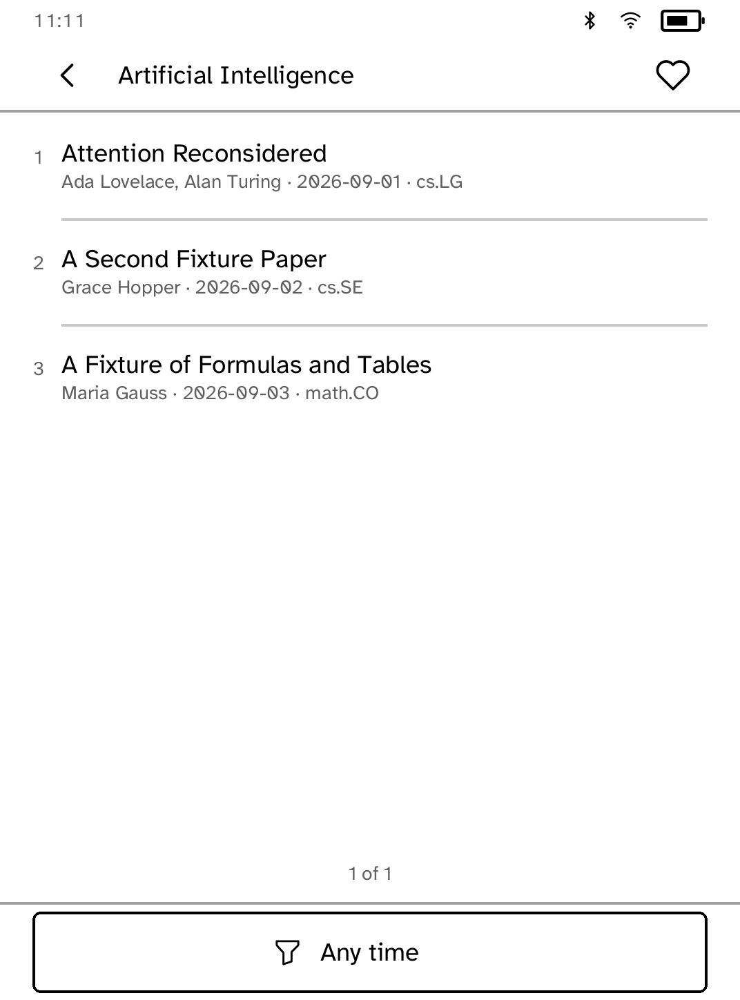
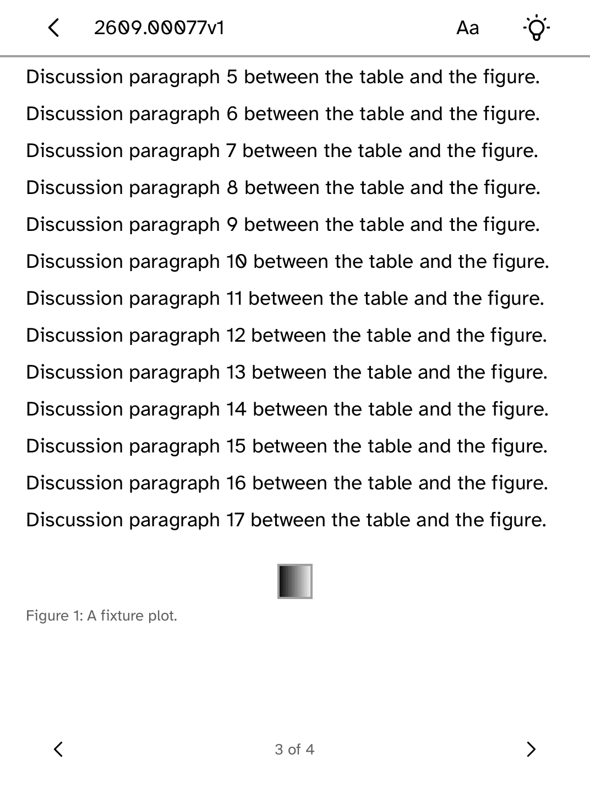
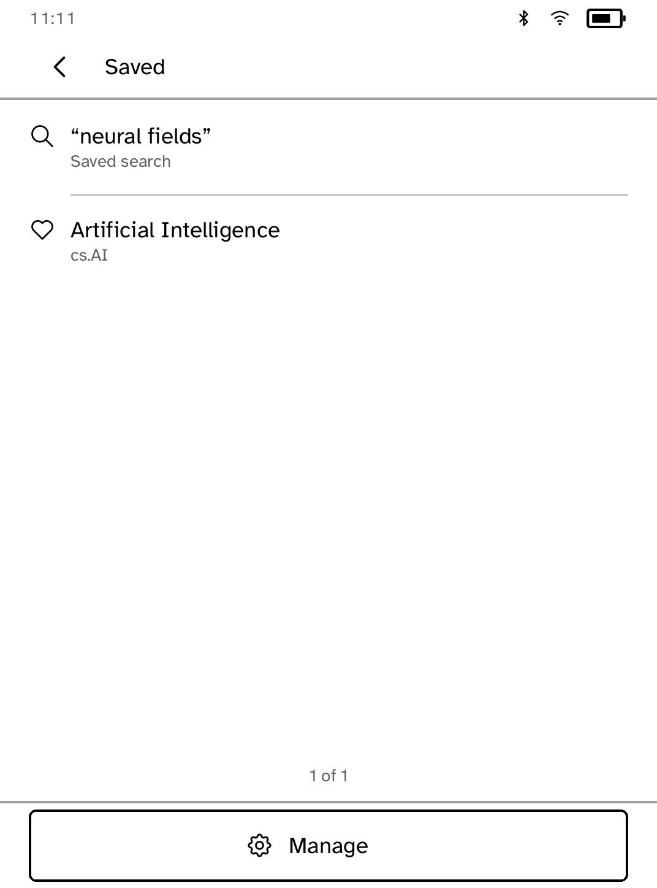

# arXiv

Browse a subject's newest preprints or search the archive, and read what comes
back on the panel rather than downloading it.

 

## The abstract is the document

A paper on arXiv is a PDF, and this platform's reader does not read PDFs. That
could have made this a catalogue with nothing behind it — a list that ends at a
title.

It does not, because arXiv has served an HTML rendering of every paper
submitted since December 2023. So a paper opens on its abstract, which always
exists, and offers **Full text** when arXiv has a rendering to give. A paper too
old for one says so plainly instead of opening an empty page.

## The rendering is a web page before it is a paper

Ahead of the paper in arXiv's HTML sit a fundraising banner, a hidden "report
an issue" form complete with its own field labels, a row of site links and the
whole table of contents; behind it, a site footer. Converted wholesale that
came out as a full first page of furniture — "Submit without GitHub", "Back to
arXiv" — before a word of the paper.

LaTeXML wraps the document itself in `<article class="ltx_document">` and puts
every one of those outside it, so the article is where the cut is made. A
rendering with no article in it is used whole: furniture is worse than the
paper, but nothing is worse than both.

## The mathematics is set, not described

A paper without its mathematics is a paper with holes in it. arXiv's renderings
carry every formula as MathML, and MathML read as prose gives back the
alphabet soup that produced it — the reader sees the parts and never the
expression.

So a formula is typeset. Each one is handed to a TeX layout engine and drawn
as a picture at the size the surrounding text is set in, so an integral sits on
the line it belongs to and a fraction has a rule between its halves. A formula
in the middle of a sentence stays in the sentence; one the author set on its
own line gets its own line back.

Drawing has a budget, because a survey paper can carry a thousand formulas and
a reader will not wait for all of them. Past the budget the remaining formulas
are read as text rather than drawn — the paper still opens, and opens quickly.

## The figures and tables come too

A table squeezed to fit is a table read wrong. Each column asks for the width
its own contents need and never gets less, so a column of three-digit numbers
stays three digits wide and the headings stay above the numbers they name. Only
when those least widths together overrun the panel does a row stack, and a
stacked row carries its headings inline — `BigToM: 0.803` — because nothing on
the page says which column a lone number fell out of. A table that runs past
the foot of the page sets its headings again at the top of the next one.

Figures are fetched from the address the paper came from and fitted to the
width of the panel, caption and all. They arrive one at a time, after the text,
so a paper with thirty diagrams in it still opens on its first page.

 

## Keeping a paper

**Keep for offline** stores the rendering on the reader, and the paper then
opens from **Library** with no network at all. The same button becomes **Remove
from library**, so keeping is a decision the reader can take back. This matters
on a device that spends most of its life away from Wi-Fi: a paper found on a
sofa is readable on a train.

## Searches and subjects worth keeping

A search worth running once is often worth running again, and retyping it is
the worst way to find that out. A word listing offers **Save this search** and
a subject listing offers **Follow this subject**; both live in **Saved**, a tap
from the subject list. A row there runs its search or opens its subject without
the keyboard, and **Manage** removes whatever stopped being worth keeping.
Following also pins the subject to the top of the list.

## Newest first, always

A preprint server sorted by relevance is a search engine; sorted by date it is
a periodical, which is what browsing a subject means. Every listing asks for
`sortBy=submittedDate&sortOrder=descending`.

Results arrive twenty-five at a time — about four screens of rows, which is as
far as anybody goes before opening something or changing the query. **Older
papers** appears on the last page, and only when arXiv says there are more
behind it.

## Subjects

Twenty of them, named as arXiv names them so the identifier on a paper's page
matches the list it was found in. arXiv has upwards of a hundred and fifty
categories and no reader wants to scroll them; search reaches the rest.

## Capabilities

`network`, and nothing else.
