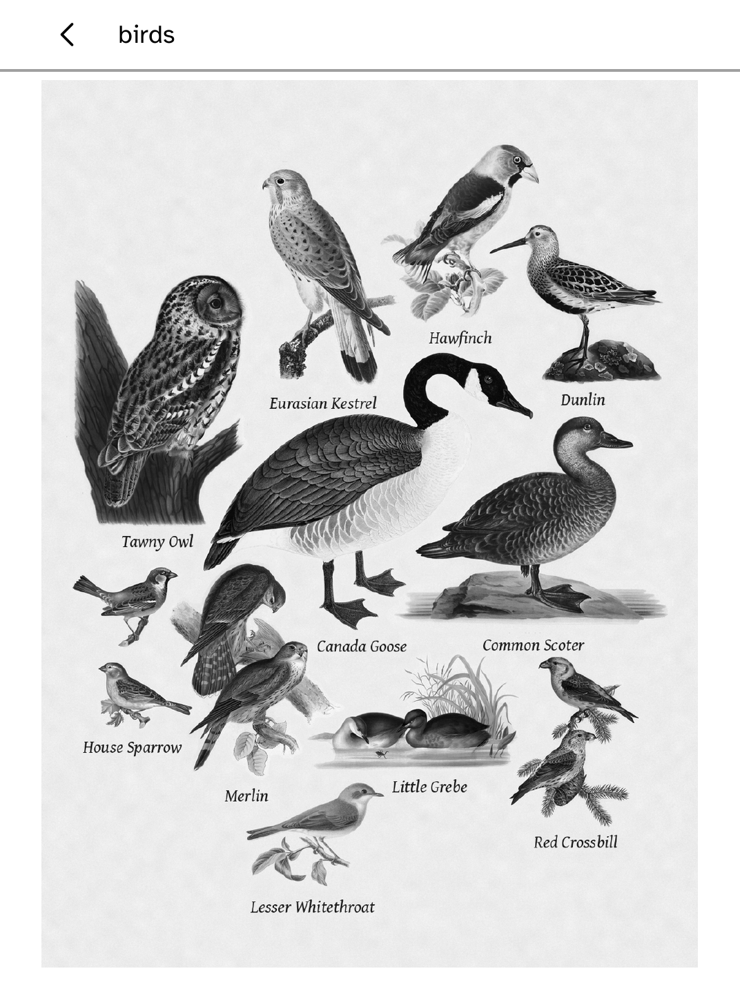
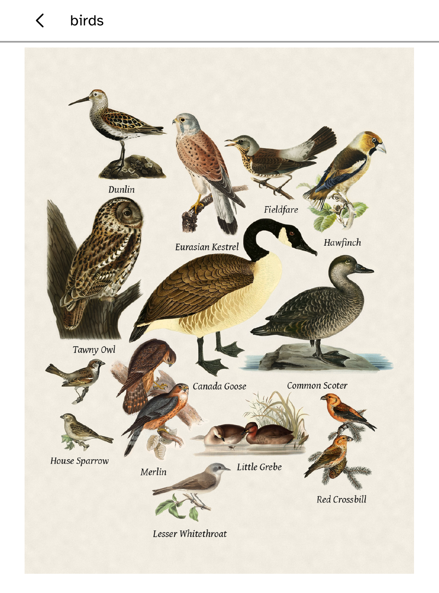

# Birds

An offline Kobo viewer for the birds [BirdNET-Go](https://github.com/tphakala/birdnet-go) hears on your computer's microphone, drawn as [Fugleramme](https://github.com/arnegiacomo/fugleramme)'s labelled plates. The reader has no microphone and never runs the model.

<p>
  <a href="../../docs/media/apps/birds/birds-on-a-clara-bw.mp4">
    
  </a>
  
</p>

A Clara BW showing twelve species heard that afternoon. [The clip](../../docs/media/apps/birds/birds-on-a-clara-bw.mp4) has sound; the GIF beside it cannot.

## Requirements

| | |
| --- | --- |
| A computer with a microphone | macOS on Apple Silicon, or Linux on x86-64 or arm64 |
| [BirdNET-Go](https://github.com/tphakala/birdnet-go/releases) | owns the microphone and the classifier |
| [Fugleramme](https://github.com/arnegiacomo/fugleramme) | polls BirdNET-Go and renders the collage |
| A Kobo running Cobalt | with SSH enabled: `kobo setup --enable-ssh` |

Upstream publishes no Intel Mac build of BirdNET-Go. Windows is out of scope; the host CLI relies on Unix process and filesystem behaviour.

Install in the order below. Each stage is silent until the one before it answers.

## 1. BirdNET-Go

Each archive carries two shared libraries beside the binary, and the binary will not start until the dynamic linker finds them.

```sh
tar xzf birdnet-go-darwin-arm64-*.tar.gz
DYLD_LIBRARY_PATH="$PWD" ./birdnet-go serve      # LD_LIBRARY_PATH on Linux
```

Then, before going further:

- **Move the web port to 8090** in `~/.config/birdnet-go/config.yaml`, written on first run wherever it was started from. BirdNET-Go and Fugleramme both default to 8080.
- **Set your location** in the same file. Without it the range filter admits every species on earth.
- **Grant microphone permission** when macOS asks. Until you do it analyses silence and says nothing about it.

`curl http://127.0.0.1:8090/api/v2/health` answers `healthy` once it is up, and the log names every sound it classifies.

## 2. Fugleramme

A Python project. Its `install.sh` and `run.sh` build a Raspberry Pi appliance through systemd and do not apply here; run the service directly and let it find no panel.

```sh
uv sync
uv run fugleramme-check --detector http://127.0.0.1:8090
uv run fugleramme-frame --detector http://127.0.0.1:8090 --host 127.0.0.1 --port 8080
```

`fugleramme-check` separates "BirdNET-Go is not reachable" from "no bird has been heard yet". The frame logs `Inky library unavailable; running web-only`, which is what you want on a computer.

**Set `rotation` to 90** in `detector/data/settings.json`, or from `/admin`. Fugleramme takes its page shape from the panel it drives, and headless it composes for a landscape one; a Kobo is portrait, and the reader would show you the middle of a wide collage with the outer birds cropped.

Once `curl http://127.0.0.1:8080/state` returns a token, that address is the `--source` below.

## 3. Birds

Install Birds from the Store on the reader, then start the companion on the computer:

```sh
kobo birds listen --source http://garden-computer.local:8080 --device 192.168.1.42
kobo birds status
kobo birds stop
```

No bird has to have been heard for this to work. With an empty detection window Fugleramme still renders and the companion still publishes, so the whole path can be proved indoors.

## How it works

Fugleramme exposes `/state` and `/collage.png`. The companion polls `/state` and pushes a new snapshot only when the token changes, over Cobalt's owner-attended SSH route. Each publication writes the collage to a content-addressed file first and commits `current.json` last as the pointer, so the reader sees either the old complete snapshot or the new one; an interrupted publish never overwrites the image the old snapshot still names.

On the reader, the collage fills the screen with no bar over it; touch the top edge to bring the bar back. The names are part of Fugleramme's rendered plate. Colour Kobos keep and paint the source RGB; greyscale models decode luminance only.

If the host, microphone or network disappears, the last complete page remains. A snapshot older than a day is marked stale. Refresh reopens local files and does not turn on Wi-Fi.

Fugleramme does not expose recent detections as machine-readable JSON, so the automatic bridge leaves that list empty. A hand-prepared `kobo birds push SNAPSHOT.json IMAGE.png` may include it.




## Licensing

Birds bundles no Fugleramme source, artwork or fonts, and no BirdNET-Go binary or model. It is an API client and transfer tool.

- Fugleramme's code is MIT; the notice is in `licenses/FUGLERAMME-MIT.txt` for downstream work that copies it.
- Fugleramme's classic artwork is CC BY-SA 4.0 and is not bundled. Anyone redistributing it must carry its per-image manifest and attribution.
- The photographs and clip at the top show that artwork on a screen, so those three files carry CC BY-SA 4.0 with attribution to Fugleramme. `THIRD-PARTY.md` says which plates and where their sources are listed.
- The fixture collage and screenshots are public-domain 19th-century plates from Wikimedia Commons. `THIRD-PARTY.md` lists every source; `scripts/fixtures/birds/build-collage.py` rebuilds them.
- BirdNET-Go and the BirdNET model are CC BY-NC-SA 4.0, non-commercial, and are not part of Cobalt.

Birds exists because of [Fugleramme](https://github.com/arnegiacomo/fugleramme) by Arne Giacomo Munthe-Kaas, whose artwork-first e-ink design it follows. See `THIRD-PARTY.md` and `licenses/`.

## Validation

[`docs/quality/birds-e2e.md`](../../docs/quality/birds-e2e.md) records the model-to-screen chain as a host and simulator run, which is all it claims. Text-scale screenshots are under `screenshots/`.

The pictures above are a Clara BW: a live microphone reached BirdNET-Go, Fugleramme drew the plate, the companion carried it over and the reader painted it. A full acceptance run against physical hardware, driven and recorded the way the report records the simulated one, has not been done.
