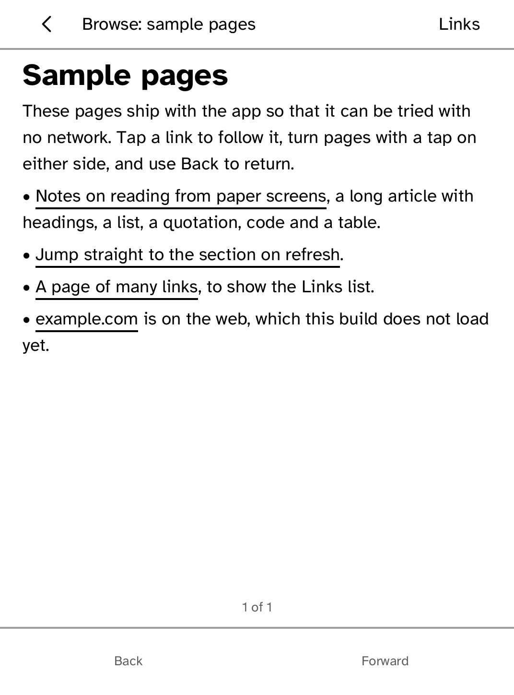
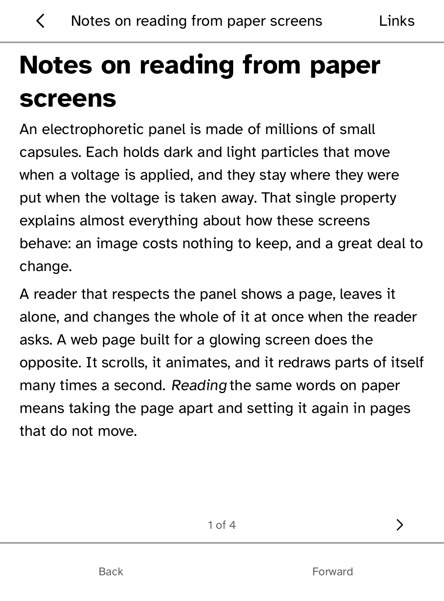
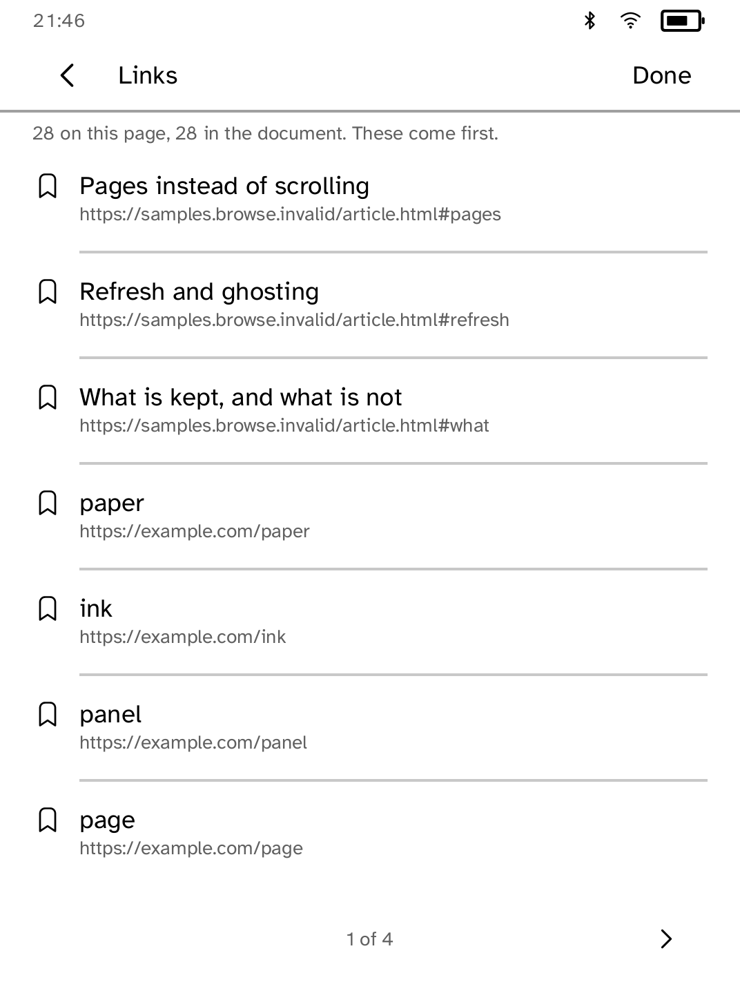
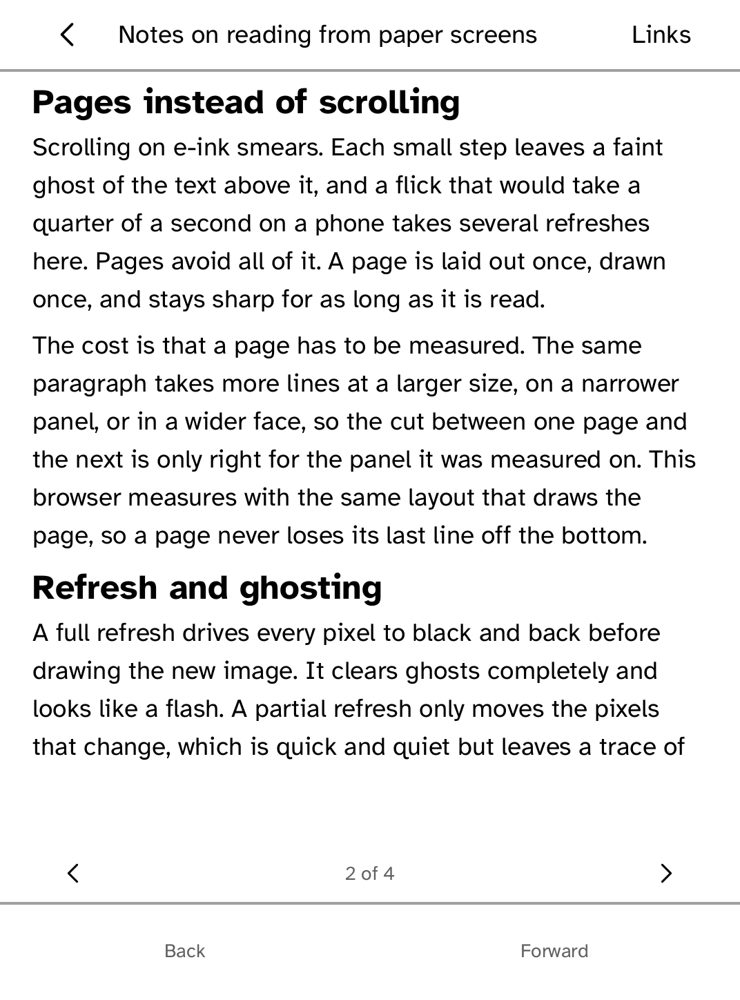

# Browser

Read web pages the way you read a book: laid out in pages, turned with a tap.

<table>
<tr>
<td width="50%" valign="top"> The sample pages</td>
<td width="50%" valign="top"> An article laid out in pages</td>
</tr>
<tr>
<td width="50%" valign="top"> Every link on a page, in a list</td>
<td width="50%" valign="top"> A link to a section opens on its page</td>
</tr>
</table>

## Features

- Pages are cut to fit the screen and the type size, and turned with a tap on
  either side. The position is shown at the bottom.
- Headings, paragraphs, lists, quotations, code and tables are kept. Scripts,
  styles, frames, video and advertising are dropped.
- Tap a link to follow it. **Links** lists every link in the page, the ones on
  the page you are reading first.
- **Back** and **Forward** return to where you were, on the same page.
- A link to a section opens on the page that section starts on.

## Limits

This build reads the sample pages that ship with it and does not fetch pages
from the web yet. There is no JavaScript. Images are not drawn; a linked image
is offered as a link.
