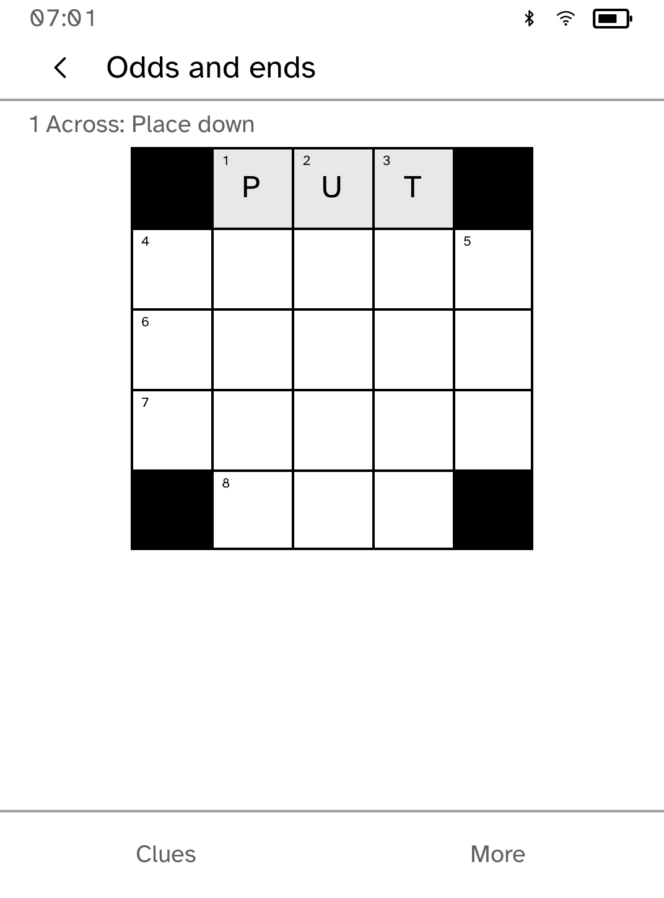

# Crossword

Four offline mini crosswords with separate saved progress. **Odds and ends** uses
joined white squares, solid black blocks and small corner clue numbers. Three
word squares offer Starter, Easy and Medium vocabulary. Ratings are editorial
guides, not measured solving times. The previous 5×5 puzzle remains available as
**Heart of the matter**, with its original answer and saved letters intact.

Crossword opens in portrait. Tap a square or choose an Across or Down clue.
The board shades the active word. While entering an answer, the full clue stays
above the word and keyboard; the outlined square is the target. The arrow in
the top bar changes direction. Enter one letter to advance within the word, or
enter the whole word to fill it from the first square. Back cancels unsubmitted
text. Letters are checked only when you ask.

**More** provides Undo, Clear, Check, Reveal and Restart. Check reports incorrect
and empty letters in the active word without changing them. Reveal fills one
square after confirmation. Restart also asks first. Both can be undone. Each
puzzle retains up to 32 undo steps, its target, direction, completion history,
check count and reveal count. Undo does not erase assistance counts. Completed
in the puzzle list means solved at least once, even after restarting.

A save is confirmed only after storage acknowledges it. If storage is full,
keep the app open, make room and choose **Retry save**. The latest letters stay
in memory and the app prevents a clean suspend until saved. Unreadable, future
or oversized records remain untouched; Retry reads them again. The old save
format is read without rewriting it until the next change. No terminal,
network account, third-party puzzle service or external puzzle data is needed.

This edition includes a local corpus; `.puz` and `.ipuz` imports, rebuses and
large Sunday grids are not supported. The old test-only `.puz` header parser
was removed because it was not an importer. Clues for this pack were written
for Cobalt; no external puzzle pack, artwork or source code was copied.

The numbered board requires the matching beta runtime from the quality PR.
Older grid messages retain their existing format. Screenshots show the actual
Clara BW simulator at extra-large text; physical Clara BW acceptance follows
the three-PR program.

Run `scripts/quality/check-crossword-sim.py --output /tmp/crossword-check` with
`CARGO_TARGET_DIR` pointing to a target containing the current `kobo` binary.
It uses private simulator storage and exercises completion, reopen, undo,
failed writes, explicit retry and both clue directions without network effects.

Completed boards clear the active-word shading. Editing an answer restores
it. Black squares remain blocked cells, as in a newspaper crossword; they are
not another game mode.

