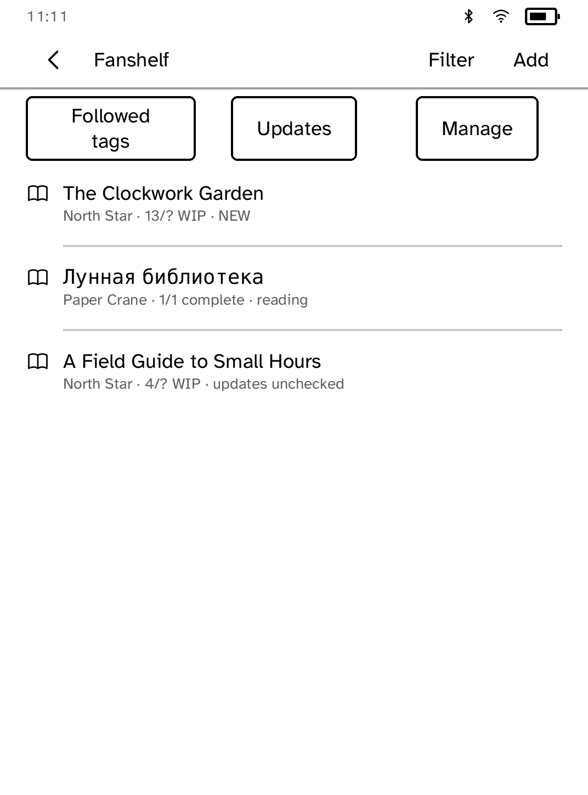
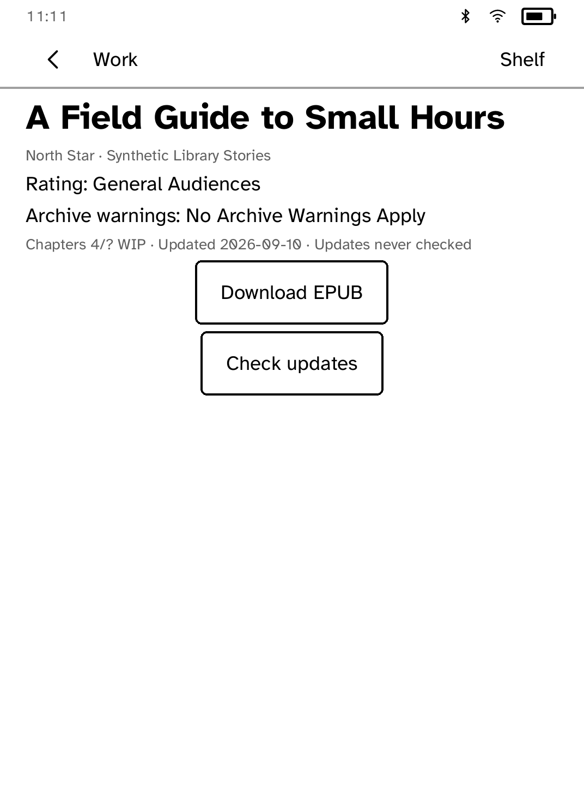
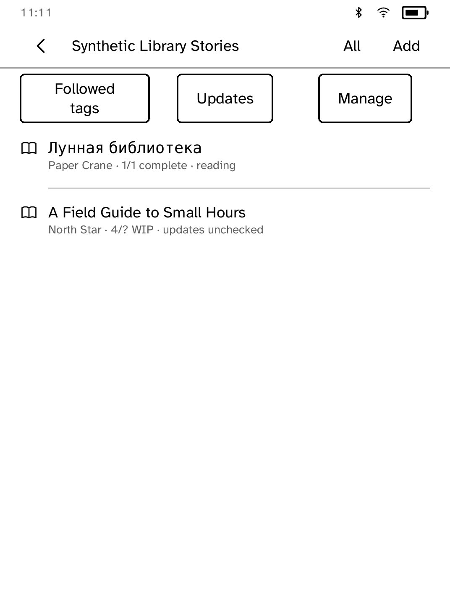

# Fanshelf

Fanshelf is an unofficial reader for [Archive of Our Own](https://archiveofourown.org/),
not affiliated with the Organization for Transformative Works (OTW). It is a
personal reading tool, not a crawler: there is no free-text search scraping,
prefetching, mirroring, redistribution, AI-training use, or background polling.
Every AO3 request follows a reader action such as opening a pasted work,
downloading its EPUB, opening a followed tag, or pressing an update button.
If the OTW asks for this behavior to change or stop, it should.

Ratings and archive warnings are rendered before the download action. An AO3
adult-content interstitial becomes an explicit Fanshelf confirmation screen;
`view_adult=true` is never added until the reader continues. Archive-locked
works cannot be downloaded; the app says so in plain words instead of
failing quietly.









## What v1 does

- Stores bounded metadata for up to 96 works: title, author, fandom, rating,
  archive warnings, summary, chapter count/status, updated date, EPUB URL,
  adult confirmation, download state, unread update state, archive removal,
  and the time of the last manual update check. A work you have started
  reading is marked on the shelf; Fanshelf shows started-or-not rather than a
  percentage, because the reader's saved place is a location, not a fraction.
- Downloads EPUBs in 256 KiB ranged chunks, spaces every AO3 request by at
  least one second, permits only one request in flight, and sends
  `kobo-fanshelf/0.2.0 (+https://github.com/BandarLabs/Cobalt)` on every request.
- Refuses EPUBs over 12 MiB and only replaces the shelf copy after the complete
  file has arrived.
- Opens downloaded EPUBs through `BookView`; page position, type settings,
  highlights, notes, and other reader memory are stored separately and survive
  a re-download when the updated document still has compatible anchors.
- Filters the shelf by fandom: **Filter** lists each fandom with its work
  count, and **All** returns to the whole shelf.
- Manages the shelf in bulk from **Manage**: download every waiting update,
  or remove downloaded copies after a confirmation. Works and reading
  places stay.
- Checks WIPs only when **Check updates** or **Check all** is pressed. A newer
  chapter sets an unread badge and enables an explicit re-download.
- Follows up to 24 AO3 tags through `/tags/<tag>/feeds.atom`, parsed with
  `kobo-xml`. Tag listings do not scrape AO3 HTML search pages.
- Treats HTTP 429 separately, honors a numeric `Retry-After` up to one hour,
  and otherwise uses a conservative exponential delay.

## Honest limitations

AO3 has no public work API. Work metadata and manual update checks therefore
parse bounded public work HTML, which can require maintenance when AO3 changes
its markup. Fanshelf does not log in, so locked works, bookmarks,
subscriptions, kudos, comments, and marked-for-later are unavailable. It does
not provide free-text search, recommendations, automatic update checks, or
background jobs. Shelf, tag, feed, and update lists are deliberately paged in
small groups for the e-ink panel.

The real Kobo was unreachable during this implementation. Simulator behavior,
storage, parser, task-wire, rate-limit, layout, and ARM cross-build checks were
performed, but Cloudflare passability and touch/reader behavior were not
validated on physical hardware and are not claimed here.

AO3 works remain copyrighted by their authors and Fanshelf never republishes
them. Downloads are initiated by the device owner for personal reading, like
pressing AO3's own EPUB download link.

## Simulator

The screenshot tour uses synthetic metadata only:

```sh
cd apps/fanshelf
FANSHELF_DEMO=1 cargo run -p kobo-cli -- dev 127.0.0.1:8787
cd ../..
cargo run -p kobo-cli -- drive --ideal \
  --script apps/fanshelf/drive.kobo \
  --shots apps/fanshelf/screenshots
```

`scripts/quality/check-fanshelf-epub-sim.py` drives the whole download-and-read
path against a local TLS fixture that serves a synthetic work page and the
repository's sample EPUB, and produces the reading screenshot above.

Without `FANSHELF_DEMO`, simulator fetches are real network requests:

```sh
cargo run -p kobo-cli -- run --sim --app fanshelf
```

## Dependencies and prior art

| Item | License | Use |
| --- | --- | --- |
| AO3 | Service | Remote service; unofficial client; OTW named and linked above |
| FanFicFare | Apache-2.0 core; Calibre plugin also GPL-3.0 | Behavior reference only; no code reused |
| Cobalt platform crates | AGPL-3.0-only | Task transport, bounded shelf transfers, XML scanner, and shared EPUB reader |
