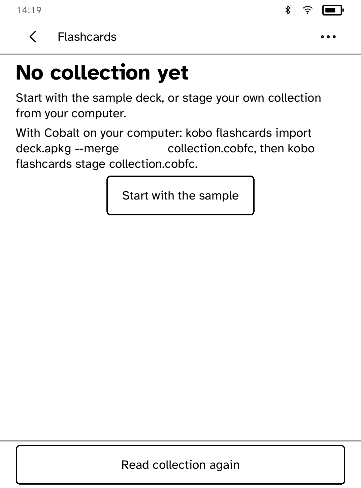
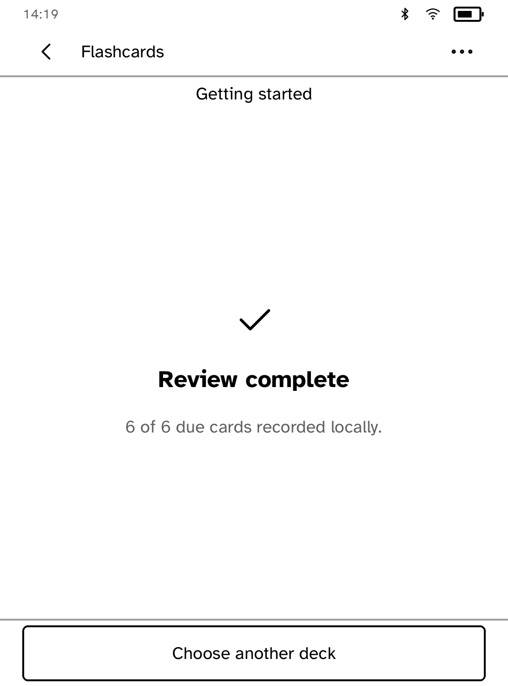
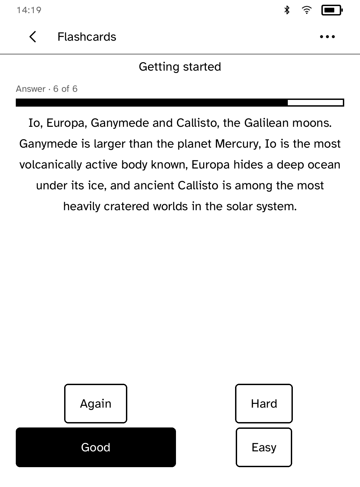
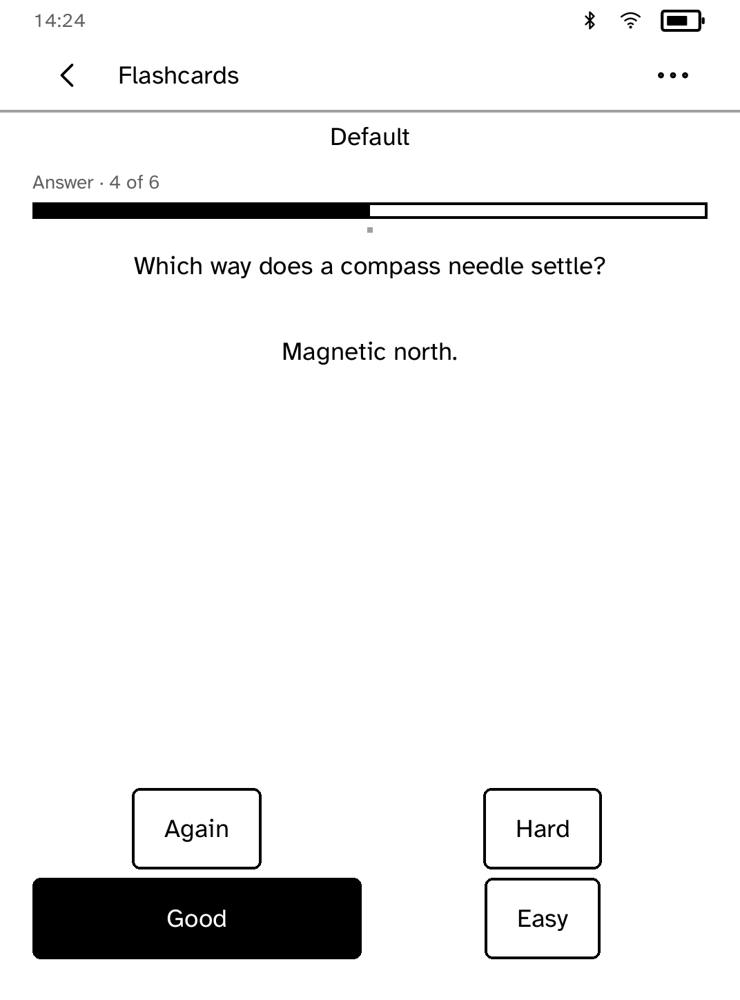

# Flashcards

Flashcards reviews a Cobalt-owned neutral `collection.cobfc` bundle in its
private Kobo shelf. The device application contains no linked study-engine
code, collection migration logic, upstream logo, or remote-network capability.
It uses only Cobalt's required local Unix-domain runtime IPC.

The separate host converter accepts only the legacy package subset documented
in [`docs/FLASHCARDS_COMPATIBILITY.md`](../../docs/FLASHCARDS_COMPATIBILITY.md)
and uses pinned Anki rslib there. Its exact source and AGPL obligations are
host-artifact notices, not device-package notices.

Prepare and stage a collection on the host, with the Kobo USB volume mounted
at `MOUNT` and Flashcards closed:

```sh
kobo flashcards status
kobo flashcards import deck.apkg --merge collection.cobfc
kobo flashcards verify collection.cobfc
kobo flashcards stage collection.cobfc --kobo-root MOUNT
```

The staging command copies only to the fixed private shelf entry
`.adds/cobalt/data/flashcards/collection.cobfc`. It writes 256 KiB durable
chunks with a digest-checked resume record and atomically replaces the final
entry only after fully validating the bundle. The application reads that one
validated name and refuses corrupt, unbounded, or path-addressable content.
Pre-neutral version-3 bundles are intentionally rejected: rerun the current
host import and stage commands to create version 4. The separately stored local
review log is not replaced.

The host derives the due queue, deck order/limits, cloze ordinals, both rendered
sides, and side-specific media references from pinned Anki rslib. The device
reviews that finite queue in imported due order; non-due, suspended, and buried
cards are absent. Review grades append only to the separately preserved,
bundle-digest-bound Cobalt owner log and do not claim to update Anki scheduling.
Cards recorded against the collection's digest stay done across launches, so a
restart never deals the same card twice; staging a new collection keeps that
log beside it.

The device UI is a sparse portrait review surface rather than a desktop-Anki
clone: choose a due deck, read one dominant card, reveal it with one primary
action, then grade with stable Again/Hard/Good/Easy positions. Long cards turn
as measured pages without moving or clipping the controls. Secondary
information, settings, and licences stay behind the top-bar menu. Semantic
emphasis survives host conversion, while arbitrary template CSS remains inert.

The device draws bounded PNG/JPEG only. Accepted SVG is parsed with no
file/data/network resolver and controlled bundled fonts on the host, then
stored as a digest-addressed greyscale PNG. At admission the Kobo re-rasterizes
SVG sources referenced by the bounded due queue and requires exact PNG
equality, and decodes every due-card PNG/JPEG before accepting the bundle. It
then displays only checked raster bytes. GIF and WebP are explicitly
unsupported. Audio and video remain visible as non-playing attachments and
cannot cause playback or network activity. Answer-only media is selected only
after reveal. A card side with more than one rendered image is rejected on the
host rather than silently dropping or reordering images for the app's single
image slot.

Atkinson Hyperlegible remains the interface face. Japanese card and SVG text
uses the deterministically derived Cobalt Japanese subset; unsupported glyphs
fail closed instead of drawing empty boxes. Its SIL OFL text, exact Noto CJK
source pin, and reproducible subset instructions ship in both applicable
artifacts.

Choose **Licences & about** from the top-bar menu to read the device notice,
resvg/font terms, source pins, and resolved device dependency notices embedded
in every `.cobalt-app` executable. Anki source and licence notices are
intentionally absent because the device binary does not link Anki code.

State-by-state 1072×1448 golden captures are under `screenshots/states/`.

## On the device, end to end

| First use offers the sample | Reviewing all six |
| --- | --- |
|  |  |

| A Japanese question | A long answer, controls in place |
| --- | --- |
|  |  |

| A card with its own image |
| --- |
|  |

*Captured by `scripts/quality/check-flashcards-sim.py` on the simulator's Clara
BW profile, end to end with no network at all.*

| Question | Answer |
| --- | --- |
|  |  |

The standalone importer requires Rust 1.88 or newer and `protoc`. The device
workspace continues to support Rust 1.85.1.

## Install the separate host helper

The main CLI starts `flashcards-import` as a separate program; it does not
link the importer's study-engine dependency. Install that helper beside
`kobo`, or put it on your PATH. For a source build, install Rust 1.88 and
`protoc`, then run from the repository:

```sh
cargo +1.88.0 build --locked --manifest-path crates/kobo-flashcards-import/Cargo.toml
```

The binary is in `crates/kobo-flashcards-import/target/debug/flashcards-import`
unless `CARGO_TARGET_DIR` overrides the build directory. Advanced setups can
set `KOBO_FLASHCARDS_IMPORT` to its absolute path. `kobo flashcards status`
shows the selected helper, its version/source and its own notice; `kobo flashcards --licenses` shows its bundled
license and source information. Distribution must retain the existing host
artifact notices and corresponding-source requirements.

To replace from a COLPKG, use the explicit `--replace` form. To preserve an
existing bundle while importing an APKG, use `--merge NEW.cobfc --merge-into
EXISTING.cobfc`. Preparation does not install cards on the reader: run `stage`
after verification, with Flashcards closed. To copy the separate review log:

```sh
kobo flashcards export-review-log --kobo-root MOUNT reviews.ndjson
```


Before importing, run `kobo flashcards formats` for the installed helper's
supported package types and limits. Modern `collection.anki21b` packages are
not supported; a filename ending in `.apkg` alone does not guarantee support.
The helper explains that reader grades remain in a separate Cobalt log and
are not automatically applied to Anki scheduling. The full compatibility
reference above describes the supported media and template subset.


Preview a verified collection before transferring it:

```sh
kobo flashcards preview collection.cobfc --out preview.html
kobo flashcards preview collection.cobfc --out second-card.html --card 2
```

Open the HTML file in a browser to compare the imported front and back, card
and due counts, and referenced media. PNG/JPEG images are embedded for offline
viewing; other media are listed by name and size. Template HTML and scripts do
not execute. This is a content preview, not an exact simulation of reader
pagination. Output files must be new, so a preview never replaces another file.


