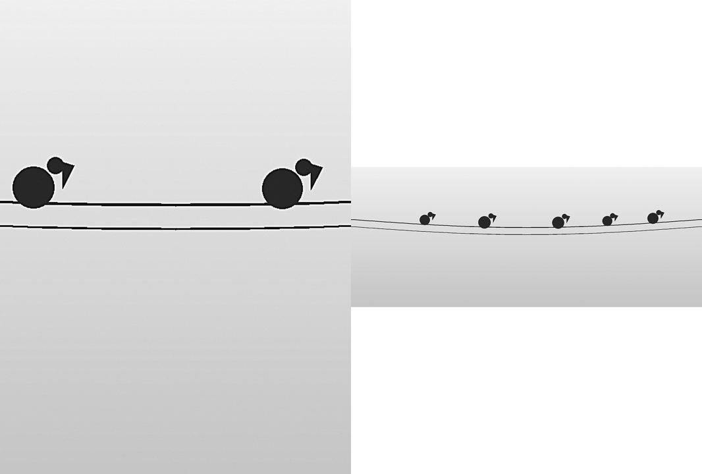

# Frame

Frame turns a Kobo into a monochrome Wi-Fi photo frame. Prepare a JPEG, PNG,
GIF, or WebP on the computer, push it over the reader's already owner-attended
SSH connection, and Frame keeps the panel-sized greyscale PNGs in its private
shelf.


```sh
kobo frame init --device 192.168.1.42
kobo frame push ~/Pictures/family --device 192.168.1.42
kobo frame push portrait.jpg --fit pad --device 192.168.1.42
kobo frame ls --device 192.168.1.42
kobo frame rm photo-0123456789abcdef --device 192.168.1.42
```

`push` processes directories in deterministic path order and preserves the ID
of identical content already on the shelf. It adds to an album by default;
pass `--delete` only when the input should replace the shelf and remove photos
not present in it. Frame accepts at most 500 photos and 150 MB of prepared
PNG data. Sources are bounded to 32 MB and 50 million decoded pixels. Camera EXIF orientation is applied before either center-crop (the
default) or white-pad fitting.

HEIC/HEIF is deliberately refused with a conversion instruction. Supporting it
would require a libheif binding, which brings LGPL considerations that do not
belong in Frame v1.

## On the reader

The home screen shows the photo count with the current photo's name, album,
and taken date, plus the awake **Frame mode** or battery-saving **Slow
slideshow** mode, interval, and stable shuffle/by-date order. It remembers
those settings and the current position. A displayed photo fills the
available unframed picture surface and the title bar names it; tap the center
for its file, album, taken date, and transfer state, previous/next, and exit
controls; tap either side to navigate. A photo pushed with `--fit pad` keeps
its whole composition letterboxed instead of filling the panel. Missing or
malformed shelf images are skipped and reported on the home screen.

Every push records a digest of the exact bytes that landed on the shelf. When
Frame opens a photo it re-checks those bytes and the photo's transfer state
reads **Verified against the manifest**; albums pushed before verification
existed read **Not yet checked** instead. A photo whose bytes no longer match
is skipped with a re-push notice rather than shown.


Frame mode keeps the app awake and advances with the SDK heartbeat at 5, 15,
or 60 minutes. Slow slideshow schedules a real SDK wake at 1, 6, or 24 hours,
then allows the reader to sleep between changes. The runtime exposes no app
sleep-screen handoff API, so Frame does **not** claim to replace Nickel's
sleep screen.

Photo changes are substantial full-panel content changes. Frame sends the
full-screen picture and the runtime's refresh planner selects its strongest
quality transition (GC16 on supported controllers). Applications have no API
to force a waveform directly, so this is deliberately runtime-owned rather
than a false app-level full-refresh promise.

## Transfer security

Frame intentionally does not start another TLS service or reserve another
port. `kobo frame` uses Cobalt's existing SSH owner-attendance path: the owner
has enabled firmware SSH and installed this machine's key through `kobo setup
--enable-ssh`. Each photo is written to a temporary file then renamed; the
manifest is published last, so the app sees either the old complete album or
the new one. This is safer than exposing a persistent unauthenticated frame
service and keeps transfer authority in the existing audited mechanism.

## Dependencies

| Library | License | Where |
| --- | --- | --- |
| `image` | MIT OR Apache-2.0 | Host preparation and device PNG decoding via `kobo-image` |

Frame is intentionally grayscale. E-ink gives a held photograph essentially
no panel power cost; changing the photograph is the work.


## Compare photos before transfer

```sh
kobo frame preview /path/to/photos --out /path/to/new-preview
```

Open `index.html` in the new directory to compare crop and pad for each photo.
Crop fills the screen and trims edges; pad keeps the whole image with white
borders. The page shows album names, reader dimensions and prepared image
storage. No reader connection or transfer is made. The default is Clara BW;
`--profile PROFILE` selects another supported reader profile. The preview uses
the same bounded conversion as `frame push`. Choose a new output directory;
an existing directory is never replaced.




Sample photograph: [Blue Marble, NASA Johnson Space Center](https://svs.gsfc.nasa.gov/30613),
Earth Science and Remote Sensing Unit. It is used here to demonstrate photo
preparation; the other validation image is an original grayscale test pattern.

## Review an album transfer

```sh
kobo frame plan ~/Pictures/family --device 192.168.1.42 --album "Summer holiday"
kobo frame push ~/Pictures/family --device 192.168.1.42 --album "Summer holiday"
```

`plan` reads the reader’s shelf and prepares the photos locally. It lists new
photos, photos already present, and image bytes to send, without transferring
or removing anything. `--album` names the incoming photos; otherwise their
folder names are used. Identical photos are reused on repeated imports.

To replace the shelf, first run `plan` with `--delete`. Review each `Remove`
entry, then use the same options with `push` to apply the replacement.
Planning is a snapshot, not a reservation: the next push reads the shelf
again and checks capacity before transferring. Before changing an existing nonempty shelf, Frame saves a recovery copy. If
that copy fails, the change is refused. Keep originals on your computer too.

## Undo the last album change

```sh
kobo frame restore --device 192.168.1.42
```

Restore brings back the shelf saved before the last push or removal, including
its album names and photo files. An unchanged repeated push does not replace
that recovery copy. Restore itself leaves the recovery copy available, so it
can be retried after a connection failure. A missing backup photo is reported
before the current manifest changes.

Recovery uses two rotating copies on the reader, each at most the size of a
previous shelf. Allow up to 300 MB in addition to the current shelf and space
for an incoming transfer. A full disk can prevent a change; Frame must finish
saving the previous shelf before it proceeds. This is one-step recovery, not
an archive of every past album. The same commands accept `--sim` for rehearsal.

## Transfer verification

A successful push says `Frame transfer verified` only after reading the shelf
back from the target. The manifest must match, every photo must be present
and nonempty, and newly transferred files must have the expected byte length.
A lost connection or failed readback returns an error instead of a success
message. This checks stored files, not whether Frame is currently open or a
photo has appeared on the physical screen. Open Frame on the reader to view
it. Hardware display acceptance remains a separate check.
