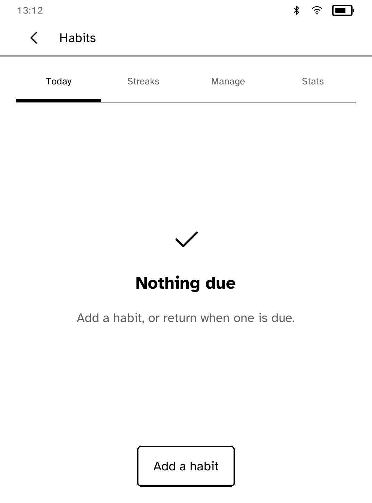
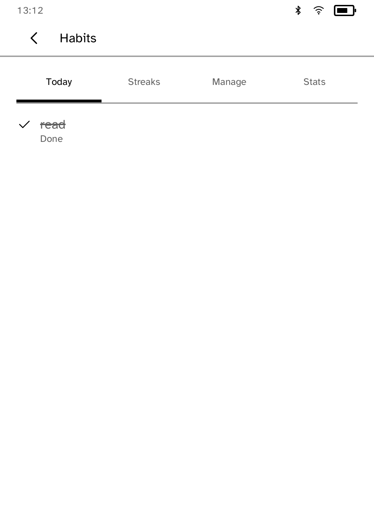
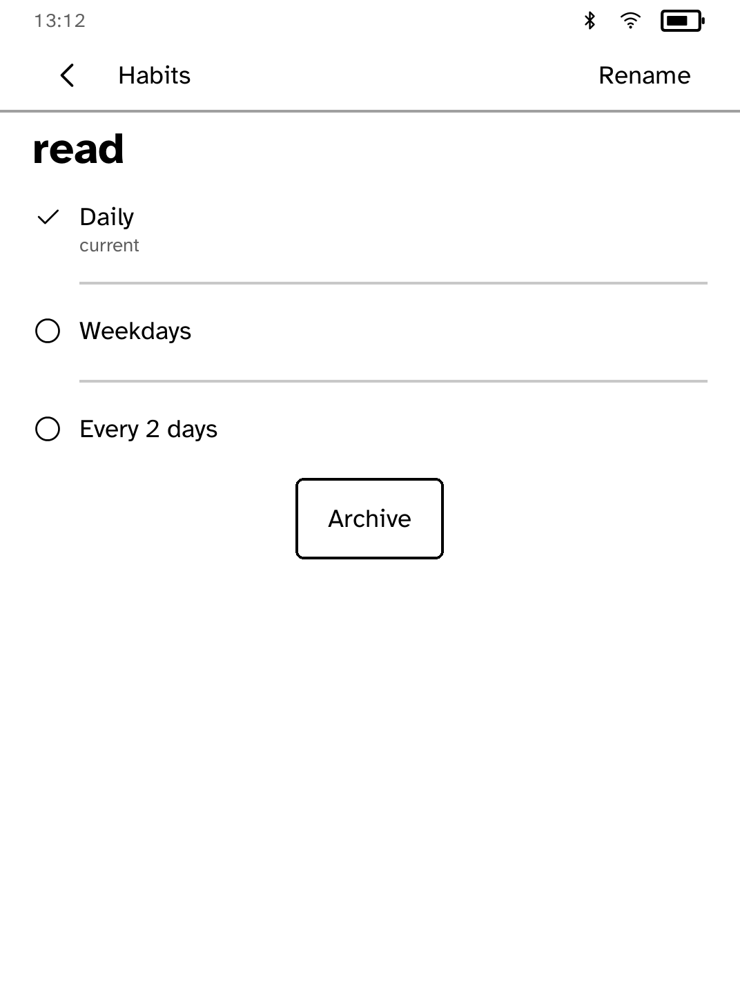
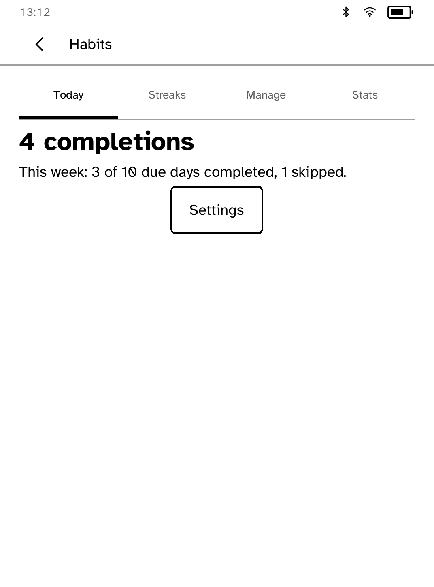
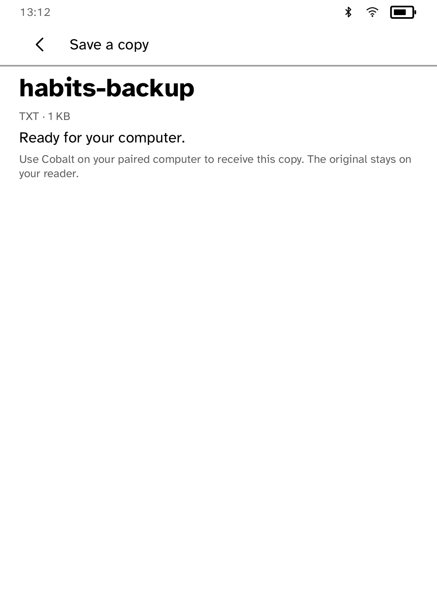

# Habits

A fully offline habit tracker. Habits and completions stay on the reader;
nothing connects an account or uploads progress. Settings can export a backup
as a verified text copy for your paired computer; the original stays on the
reader.

| The empty Today offer | A finished day |
| --- | --- |
|  |  |

| Editing a habit | The week on Stats |
| --- | --- |
|  |  |

| The backup, ready |
| --- |
|  |

*Captured by `scripts/quality/check-habits-sim.py` on the simulator's Clara BW
profile, end to end with no network at all.*

## Repaint policy

Tapping a habit repaints that row once for its checked state.
