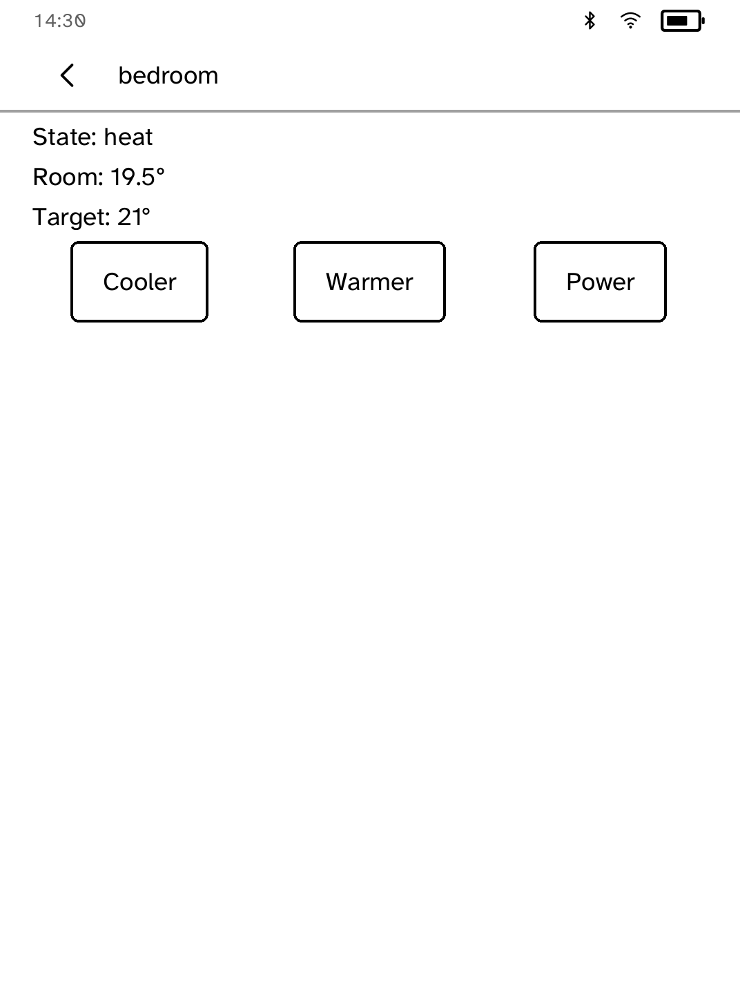
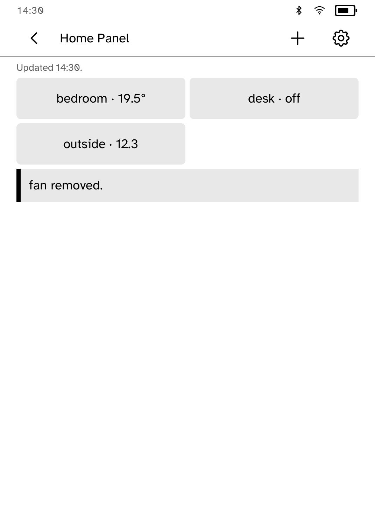

# Home Panel

Tiles for a Home Assistant installation, on a panel that costs nothing to
keep showing them. This is a client for Home Assistant; it is not affiliated
with Nabu Casa.

Set the URL once, then install the long-lived access token outside the app:

```sh
kobo secret set homeassistant --device <ip>
```

The URL must be HTTPS. Use Nabu Casa, a reverse proxy with a real
certificate, or install a private CA with `kobo trust set homeassistant
--device <ip>`. Home Panel posts one compact Jinja template per poll and
never puts the token in its URL, body, log, or local store.


## Tiles

Use the `+` action to browse or search Home Assistant devices by their
friendly names, or type an entity id exactly. The grid keeps up to twelve
tiles, refreshes them every ten seconds while open, and keeps the last
visible state available when the server cannot be reached. Lights, switches,
scenes, scripts, automations, and buttons can be triggered directly;
unsupported domains remain useful as read-only tiles.

Every action answers with a named acknowledgement that stays on screen until
the next action, and a failure names the cause and the fix. The header stamps
the last successful refresh; when the server stops answering, the panel keeps
showing the last readings and says since when.


## Climate

Tapping a climate tile opens the room and target temperatures, adjusts the
target in half-degree steps, and switches the unit off and on.



## Editing tiles

Settings holds tile editing: remove a tile or move it up the grid, paged six
at a time. The layout survives restarts.



## Wall panel

Settings also switches the grid to a one-column layout sized for a panel
mounted on a wall.


