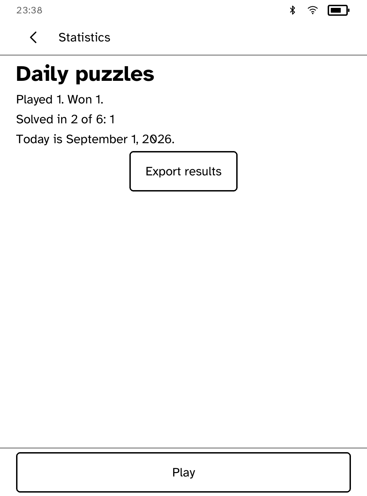
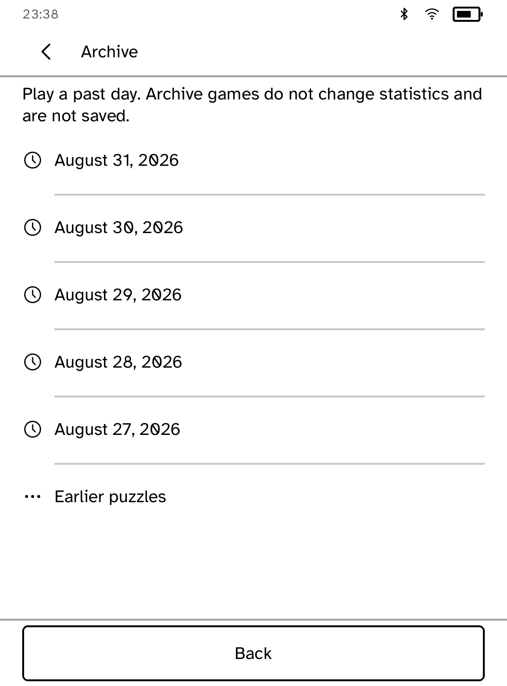

# Inkling

An offline daily five-letter puzzle. The answer is `answers[djb2(YYYY-MM-DD ++ salt) % len]`, so
one shipped build produces the same daily game everywhere without a network service. Shape states
are grayscale-first: `[L]` is placed, `(L)` is present, and `L×` is absent, always in uppercase so
the letter and its state read at a glance.

The game includes six guesses, duplicate-correct scoring, hard-mode revealed-letter checks, saved
daily progress, and cumulative played/won statistics with a win distribution by guess count. While
you type, the panel lists the letters your earlier guesses have already proven: placed positions,
letters elsewhere in the word, and letters that are out.

**Export results** writes the day's board and your statistics to `export-result.txt` in the app
store, ready to fetch from a computer. The archive plays any of the past 365 days; archive games
never touch statistics and are not saved.

The puzzle day is UTC; `KOBO_INKLING_DAY=YYYY-MM-DD` pins it for simulator recordings. The title
shows the real date, not a puzzle number. Word lists are hand-audited common English: 870 possible
answers and about 1,900 additional accepted guesses, with no copied commercial game list.

## Capabilities

None. Inkling is offline forever.
