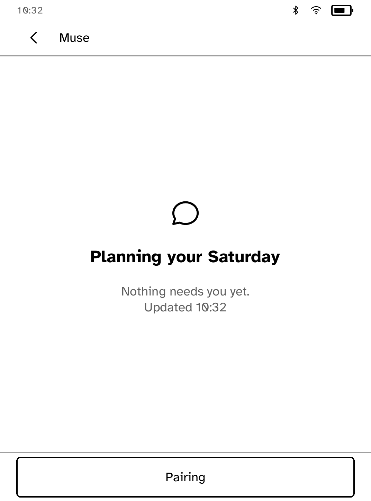
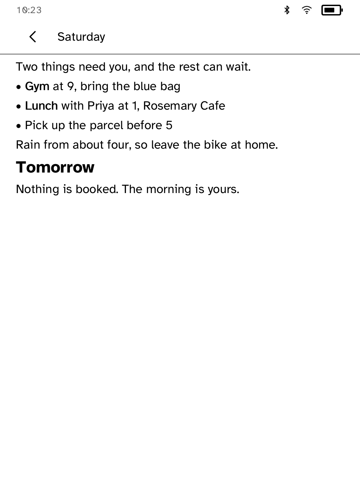
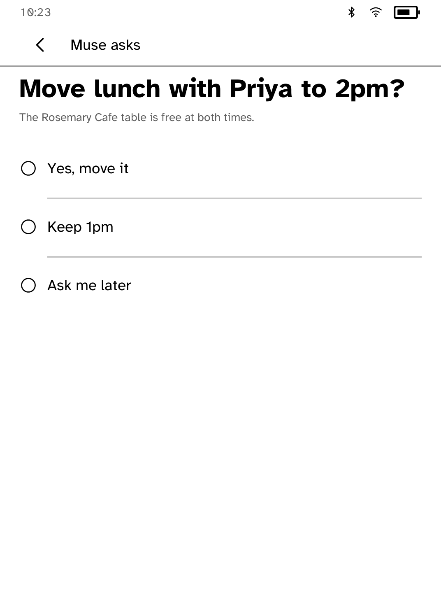
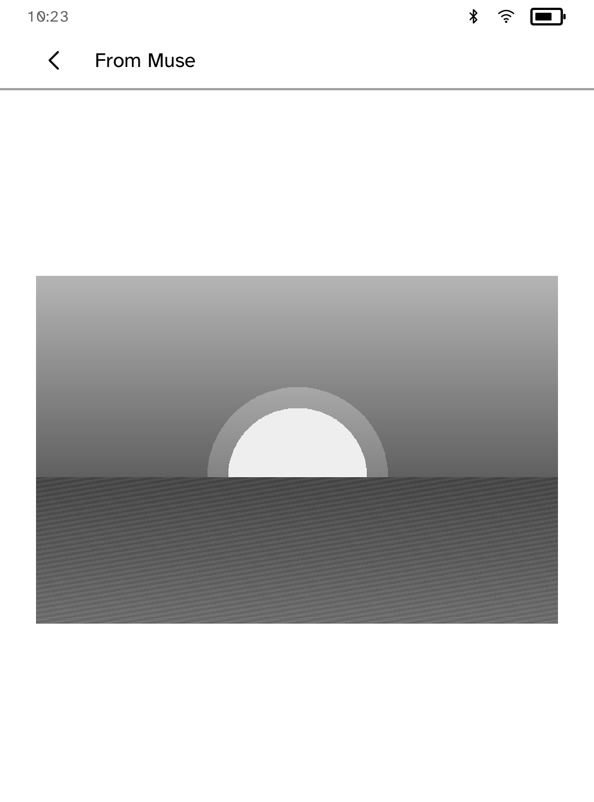

# Muse Panel

Let Muse put a page, a status line or a question on your Kobo, and answer with a tap.

<table>
<tr>
<td width="50%" valign="top"> What Muse is doing</td>
<td width="50%" valign="top"> A page Muse wrote</td>
</tr>
<tr>
<td width="50%" valign="top"> A question with answers to tap</td>
<td width="50%" valign="top"> A picture Muse drew</td>
</tr>
</table>

Muse is the assistant that runs your account's gadgets. A gadget is a device it
can call commands on. This app is the Kobo half: it shows what Muse sends and
sends your taps back. A small bridge on a computer holds the link to Muse,
because the Kobo cannot keep one open itself.

## Features

- A resting screen with Muse's status line, drawn only when it changes.
- Pages with headings, bold, lists and quotes. Long pages turn into screens.
- Questions with two to six answers. A tap goes back to Muse as a chat message.
- Full-screen pictures, in grey or colour to match the panel.
- Redraws only when Muse changes something. A quiet poll draws nothing.

The reader asks the bridge for changes with one long poll at a time. Updates
can take up to a minute to appear, and nothing wakes the Kobo from sleep.

## Setup

1. On a computer paired with Muse as a gadget, install the bridge and run
   `kobo-bridge init`. It prints an address, a six-character pairing code and
   the path of a certificate authority file.
2. Install that certificate on the Kobo:
   `kobo trust set muse-panel --from CA.pem --device IP`.
3. Open Muse Panel, type the address, then the code. The pairing is
   remembered.
4. Run `kobo-bridge run` and leave it running.

The companion bridge is a separate Python package and is not part of this
repository, so this app cannot vouch for what it does. This app only asks it
for display content and sends back the answer you tap.

## Privacy

What this app does, and what you can check in its source:

- It talks to the bridge address you type, over HTTPS, using the certificate
  you installed with `kobo trust set`.
- It stores one pairing record: the bridge address and a token, in the app's
  own storage. The token is sent in an `X-Muse-Panel-Token` header, never in a URL.
- It declares the network capability only (see `cobalt-app.json`).

How the bridge handles the pairing code, token and commands is up to the
bridge and is not covered here.

## Notes

The Kobo only reaches the bridge over your local network. If the computer
sleeps, the panel keeps the last screen and names the problem.
