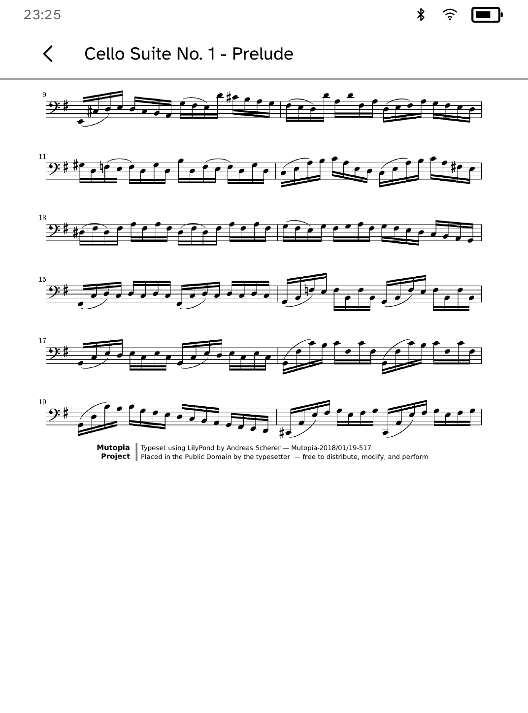
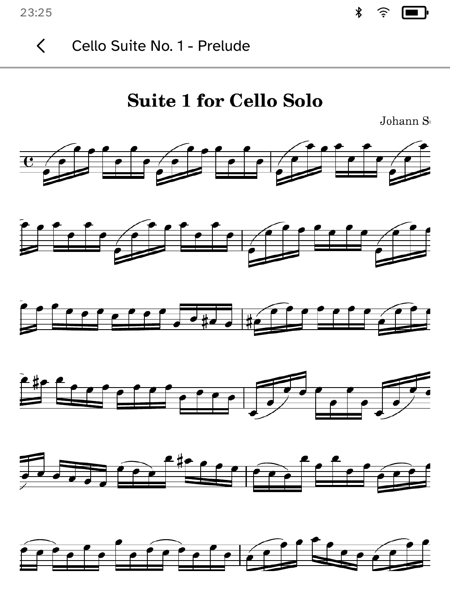

# Music Stand


Music Stand turns a Kobo on a folding stand into a score reader. Pages are
prepared on your computer and pushed over USB or SSH; the reader keeps the
panel awake, turns pages with the physical page buttons or the tap zones, and
splits each page into two overlapping halves so the line you are reading is
still in sight after a turn. A staff-width zoom keeps dense passages legible,
and every score remembers its page, zoom and corner mark between sessions.
Setlists keep rehearsal order and walk straight from one piece's last page
into the next.

Transfer is host-side:

```sh
kobo musicstand init --device IP
kobo musicstand push score.pdf --device IP
```

PDF scores are rendered page by page with pdftoppm; folders of PNG or JPEG
images transfer as they are. Only transfer scores you have the right to use.

## On the device

Pushed with the companion CLI from a real public-domain score (BWV 1007,
typeset by the Mutopia Project).

<table><tr>
<td><br>A whole page at reading size</td>
<td><br>A half-page turn keeps the line in sight</td>
</tr><tr>
<td><br>Staff-width zoom for dense passages</td>
<td><br>Setlists remember where each piece resumes</td>
</tr></table>

`drive.kobo` captures the empty shelf; the pushed-score journey lives in
`scripts/quality/check-musicstand-shelf-sim.py`.
