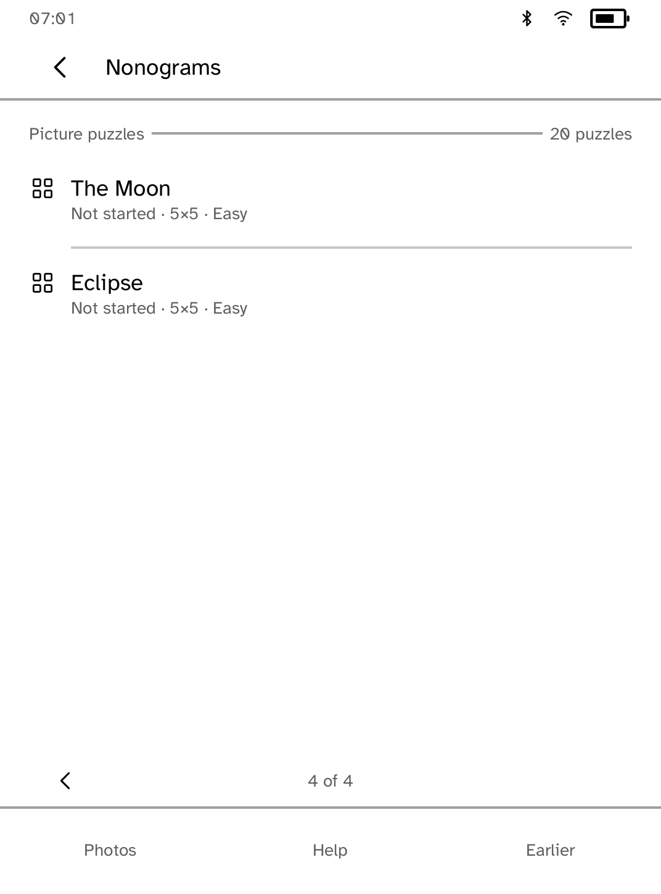

# Nonograms

Solve 18 original picture puzzles using the clues attached to each row and column. The collection includes a house, heart, tree, cup, key, fish, moon, rocket and other small drawings, with boards from 5×5 through 25×25. Large boards use a movable window instead of smaller touch targets.

**Earlier** opens the previous 60-puzzle study pack. Its puzzle IDs, answers and progress keys are unchanged. **Pictures** returns to the new collection. New pictures use separate `picture-NAME-v1` identities, so saving one cannot overwrite an earlier game. Imported photos appear with the picture collection.

## Play and inspect

Tap a square to cycle **blank → filled → crossed out**. A cross records a square you have decided is empty. Complete every square, including crosses, to finish.

The selected square has an ink outline. Its row and column clues also have a shaded field and outline. Tap a clue to read its complete sequence; **…** means more numbers than the gutter can show. Back returns to the same board window. A zero clue means the line is empty.

**Left, Up, Right and Down** move the window with an overlap. **−** and **+** change square size. Disabled controls keep their positions. Panning keeps absolute cell identities; an edit to row 25, column 25 never becomes an edit to the first visible square. The header identifies the selected square (or the panned range when that square is offscreen) and counts the marks made so far; the selected square’s row and column clues carry a compact chip. Wide displays use two rows of controls; portrait uses three.

## Help, undo and checking

**More** opens checking, run entry and restart options.

- **Free** accepts your marks without warnings. Switch to **Guided** to name a row or column whose remaining arrangements contradict its clues. A warning never silently changes your marks.
- **Run on** fills a horizontal or vertical run between two taps. A diagonal pair is refused.
- **Undo** reverses one square, an entire run or a confirmed restart. The last 64 move snapshots survive reopening.
- **Restart** asks before clearing the board and can be undone.

The completed picture opens when all fills and crosses match. Undo can reopen it. The browser’s Solved label records puzzles completed at least once.

## Saving

Each puzzle has its own `progress-ID` record. Versioned records use schema `nonograms.game` version 1 and a 64 KiB bound. They retain marks, the last edited/recorded selection, checking and run preferences, and up to 64 undo snapshots. The record also checks the full answer digest so it cannot silently restore into a changed puzzle. The shipped mode-plus-marks record still opens; its next edit writes the new format.

Only the exact storage acknowledgement marks a released revision saved. Newer edits wait behind it. Failed writes keep the latest changes in memory and offer **More → Retry save**. Saving the solved index also waits for its own acknowledgement. Finish saving before switching puzzles or closing the app; a forced stop before successful retry can lose unsaved edits.

Corrupt, oversized or future records stay untouched. Retry reads them again; Puzzles returns to the browser without overwriting them. Imported-photo identity includes its image content and selected size.

## Photo puzzles

The computer companion sends photo puzzles:

```sh
kobo nonograms push IMAGE --size N --device READER
```

Choose the same size in **Photos**, then **Import**. Grid sizes from 5×5 to 25×25 are accepted. To send several at once, the push writes an `imported.txt` list beside the photos, one line per puzzle with the file name, puzzle name and grid size. Each listed photo arrives as a named puzzle. Reimporting an unchanged photo keeps its saved progress, and photos a push no longer names leave the shelf.




The app accepts an image-derived puzzle only when repeated row/column deductions determine its entire answer. Ambiguous or unsupported inputs are refused. The displayed solver rating is **Easy** for one productive pass, **Medium** for two or three and **Hard** for more. This repeatable guide describes solver work, not measured human difficulty. The earlier study pack remains available for existing games. The new collection uses 18 distinct original drawings; every answer is determined by the line solver.

## Original drawings

The pixel masters and their larger-grid construction are recorded in [make-nonogram-pictures.py](../../scripts/quality/make-nonogram-pictures.py). No external puzzle corpus or artwork is used. The larger grids deliberately retain the simple block drawing style. The generator independently checks row/column deduction before writing [pictures.txt](assets/pictures.txt); Rust checks the final shipped answers, distinctness and unchanged earlier identities.

```sh
python3 scripts/quality/make-nonogram-pictures.py
```

## Validation

Run from the repository root, using one `CARGO_TARGET_DIR`:

```sh
cargo test -p kobo-nonograms
cargo clippy -p kobo-nonograms --all-targets -- -D warnings
cargo build -p kobo-cli
python3 scripts/quality/check-nonograms-sim.py --output /tmp/nonograms-check --scale extra-large
```

Tests cover attached clue geometry, all board cells at nine interface sizes on two physical profiles in both orientations, persistent atomic undo, legacy restore, invalid-record preservation, exact acknowledgements and save retry. The actual SDK simulator journey uses private temporary storage and original bundled fixtures. It checks full clue inspection, forced restarts, run undo, failed saves, recovery and the final square of a 25×25 board. See [screenshots](screenshots/README.md) for capture provenance. Physical Clara BW acceptance follows all three PRs.
