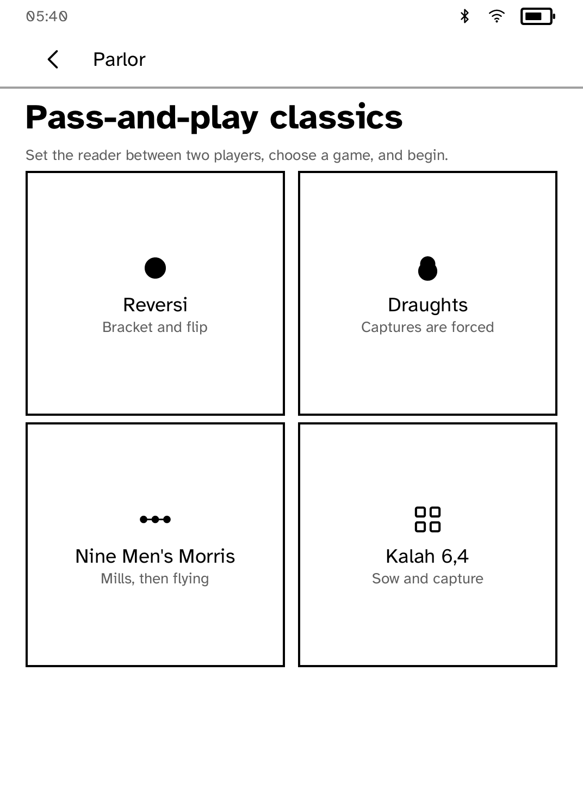
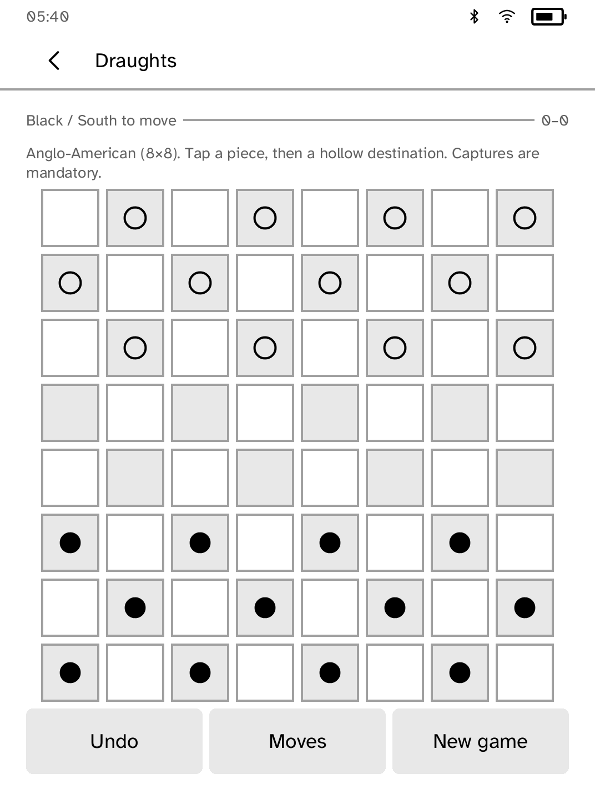
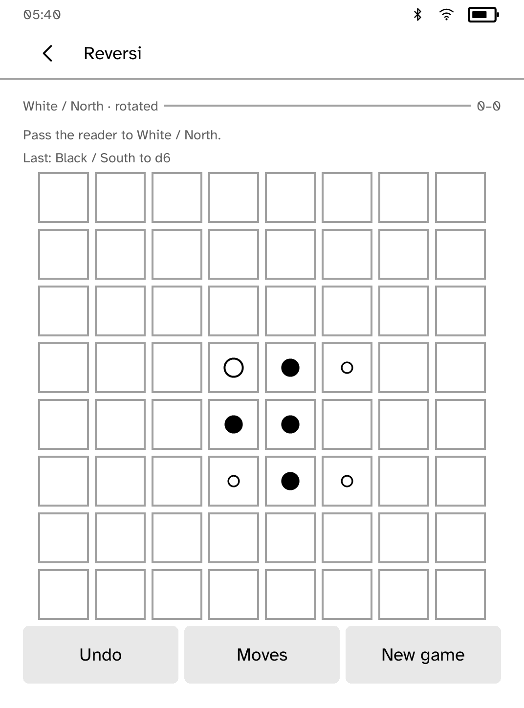

# Parlor

Parlor is a four-game, offline board-game shelf for Kobo:

- **Reversi**
- **Draughts**, with Anglo-American 8×8 play; the implemented International
  10×10 rules remain disabled until the 81-cell reader board limit is lifted
- **Nine Men's Morris**
- **Kalah 6,4**

Pass-and-play is the primary mode. The board turns 180° for the active player,
with an optional fixed orientation for side-by-side play. Solo games offer
Casual, Club, and Strong deterministic alpha-beta opponents. Every move
autosaves, reopening offers to resume the exact position, and pass-and-play
undo requires confirmation from the other player.

The shared search core uses fixed limits so play remains responsive: Casual is
depth 1 / 500 nodes, Club is depth 3 / 5,000 nodes, and Strong is depth 5 /
30,000 nodes. Legal moves are ordered deterministically, so identical
positions and settings produce identical choices.

Move entry uses hollow legal-destination marks. Draughts enforces mandatory
captures, continued capture chains, the Anglo-American forward-capturing man,
and, in the engine, the International flying king and maximum-capture rule.
During an International sequence, captured pieces remain on the board as
blockers and cannot be captured again; they are removed together when the
sequence ends. Morris covers
placement, mills, protected-piece removal, adjacent movement, and flying with
three pieces. Kalah covers counter-clockwise sowing, skipped opposing stores,
captures, extra turns, and endgame collection.

Rules references:

- Reversi: World Othello Federation, *Rules of Othello*
  (<https://www.worldothello.org/about/about-othello/othello-rules/official-rules/english>)
- Anglo-American draughts: World Checkers/Draughts Federation, *Official Rules*
  (<https://www.wcdf.net/rules/rules_of_checkers_english.pdf>)
- International draughts: FMJD, *Official Rules of International Draughts*
  (<https://www.fmjd.org/docs/Annex_1.pdf>)
- Nine Men's Morris: Board Game Arena rules
  (<https://en.boardgamearena.com/doc/GamehelpnineMensMorris>)
- Kalah: Mancala World, *Kalah*
  (<https://mancala.fandom.com/wiki/Kalah>)

The engines and AI are original Rust code. The third-party engine ledger is
empty. “Othello” is a Megahouse/Mattel trademark; Parlor always calls the game
Reversi.
