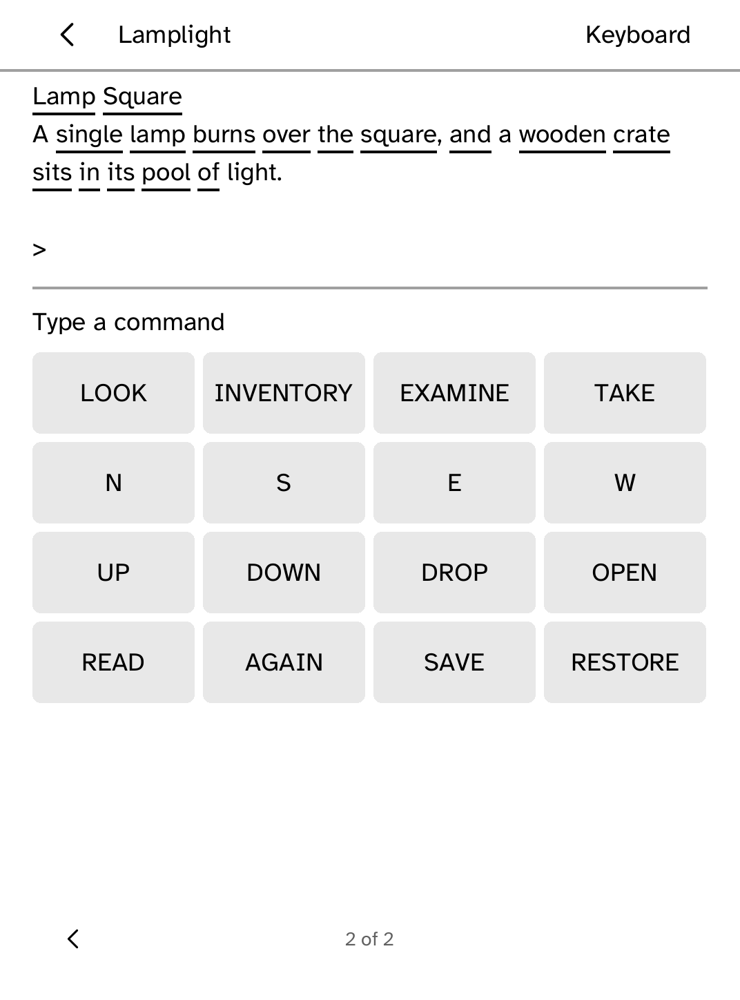

# Parser

Play interactive fiction offline on your Kobo.

<table>
<tr>
<td width="50%" valign="top"><br>A story open, with words to tap and command buttons</td>
</tr>
</table>

## Features

- Plays text-only Z-machine stories in versions 3, 5 and 8 (`.z3`, `.z5`,
  `.z8`).
- The transcript is set as prose, with page turns by tap or page button.
- Type commands, or tap LOOK, INVENTORY, EXAMINE, TAKE, directions, UNDO,
  SAVE, RESTORE and AGAIN. Tap a word in the transcript to add it to your
  command.
- Ten save slots per story, plus an autosave after every turn. Reopening a
  story continues where you stopped.
- *First Light*, a short original tutorial story, is included.

## Adding a story

Parser never downloads games. Send a story file you own from your computer:

```sh
kobo parser inspect game.z5                       # format, title and compatibility
kobo parser push game.z5 --device 192.168.1.23    # --replace overwrites a copy already there
```

Then open Parser and tap **Refresh library**. Unsupported formats are refused
before they are sent.

## Limits

- No graphics, sound or version 6 stories.
- Glulx, TADS and Ink are not supported.
- Timed input is treated as ordinary turns.
- The standard Z-machine test suites have not been run on a Kobo yet, so treat
  compatibility as a preview.

## Permissions

None. Parser runs offline.

## Development

```sh
cargo test -p kobo-parser
python3 scripts/check-apps-sim.py parser
```

The simulator check builds the app, opens it in a fresh simulator and plays
`drive.kobo`.

## Credits

The interpreter in `src/zvm/` is original AGPL-3.0-only code written to the
[Z-Machine Standard 1.1](https://inform-fiction.org/zmachine/standards/z1point1/index.html).
*First Light*, the bundled tutorial story, is also original and AGPL-3.0-only.
No third-party stories are included. Commercial Infocom stories, including
Zork, are never bundled.
