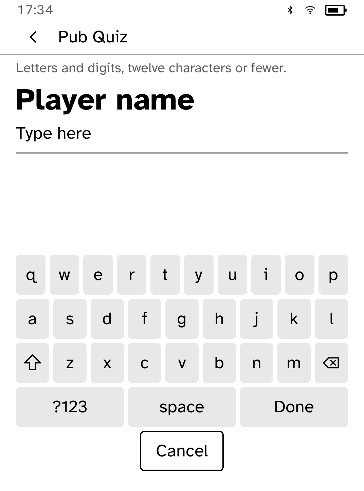
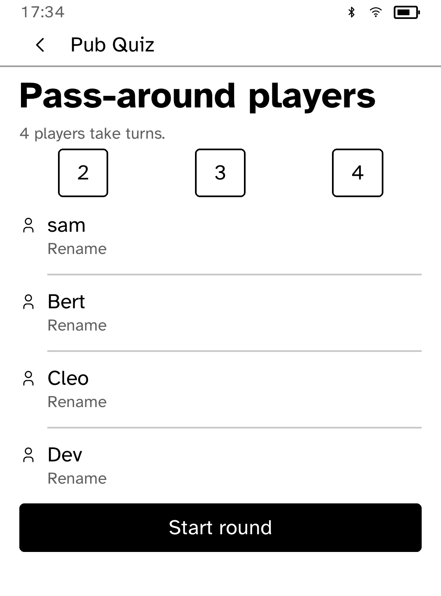

# Pub Quiz

Pub Quiz syncs Open Trivia DB packs while online and plays them offline. Solo
rounds are ten questions. Pass-around mode rotates named players and puts an
interstitial between answer lock and reveal, so the next player cannot peek.
The app keeps streaks and pack counts in its store and caps the cache at ten
packs, pruning oldest packs first.

Questions come from [Open Trivia DB](https://opentdb.com/) under
CC-BY-SA 4.0. Cached question packs are redistributed content and remain under
CC-BY-SA 4.0; an attribution and license file are carried with app data.

`drive.kobo` starts pass-around mode and captures a real simulator panel.
