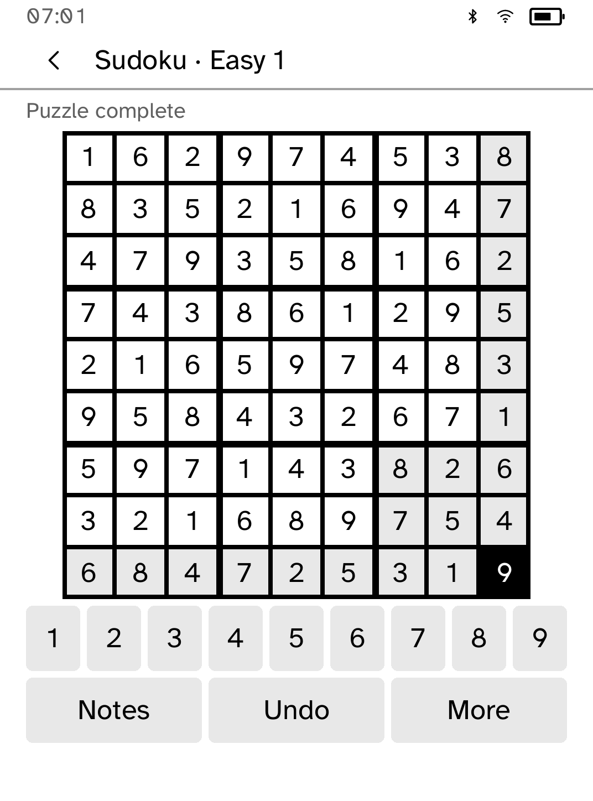
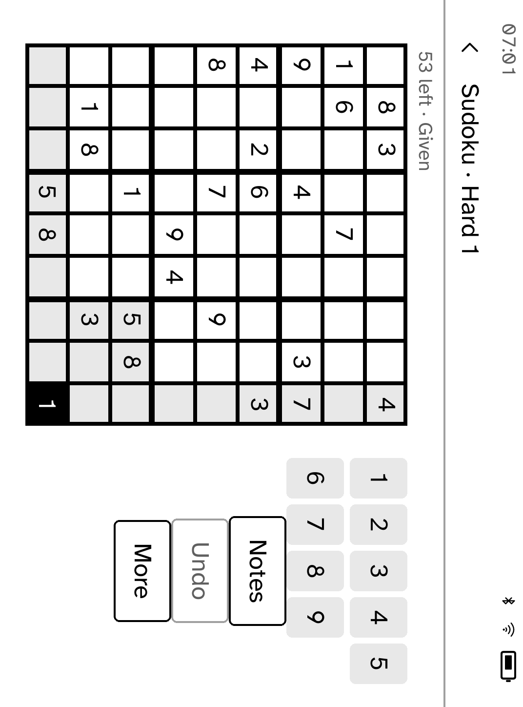

# Sudoku

36 original puzzles, ready to play offline. Each difficulty has 12 puzzles with exactly one solution. Your answers, pencil notes, selected square, orientation, checking preference and last 64 undo steps survive reopening.







## Play

Tap a square, then a number. Given numbers cannot change. The light cross follows the selected row and column; a bracketed number or small square identifies your target. Extra spacing separates the 3×3 boxes.

Tap **Notes** to make pencil notes. Tap numbers to add or remove them; outlined keys show the selected square's notes. A dot marks other squares containing notes. Tap **Digits** to return to answers. To replace a filled answer with notes, use **More → Erase** first.

**Undo** restores one edit, including an erase, reveal or confirmed restart. It retains up to 64 edits across app restarts. It does not cross into a different puzzle.

## Choose your level of help

Checking starts off. Entries are accepted even when they are wrong. **More → Check off** turns checking on; selecting a wrong answer then shows “Check this answer.” This never replaces or removes your answer.

**More → Reveal** asks before filling the selected square with its solution. A reveal counts as a hint and can be undone. Completing every square correctly shows **Puzzle complete**; the save status remains separate until storage acknowledges it.

**More → New** offers Easy, Medium and Hard. Choosing a difficulty starts the next puzzle in that group and replaces the current game and its undo history. The choice screen explains this; Back keeps your game. After puzzle 12, the group cycles back to its beginning. **Restart** asks first and can be undone.

- **Easy:** solvable using squares with one remaining candidate.
- **Medium:** additionally needs numbers with one possible location within a row, column or box.
- **Hard:** cannot be finished using just those two techniques. Difficulty is a technique-based guide, not a promise about solving time.

## Hold it your way

Use **More → View → Use landscape** to rotate. Portrait shows all 81 squares. Landscape shows overlapping views of rows 1–6 and 4–9, with a range button to change views; square identities and touch targets stay intact. Reopening retains the orientation and reveals the saved selection. Help is under **More → View → How to play**, with pages measured for the current orientation and text size.

## Saving and recovery

Changes save automatically. “Saving…” does not mean saved; rapid edits wait behind the active write and then save the latest version. A failed save keeps the latest game in memory and blocks a clean suspend acknowledgement. **More → Retry save** retries it after storage becomes available. Closing or forcibly stopping the app before a successful retry can lose those unsaved edits.

Unreadable, oversized or newer save records are preserved. The app offers Retry and does not silently replace them with a blank game. The record is `game`, schema `sudoku.game` version 1, bounded to 48 KiB. Puzzle identity and immutable clues are checked before restore. Earlier Sudoku versions had no persistent game to migrate.

## Original puzzle pack

[assets/puzzles.txt](assets/puzzles.txt) was generated specifically for this app using [make-sudoku-pack.py](../../scripts/quality/make-sudoku-pack.py). No external puzzle corpus, artwork or reference-project code is included. The fixed generation seed reproduces the pack. The generator classifies solving techniques and checks uniqueness; an independent Rust backtracking test rechecks all 36 puzzles and their solutions.

```sh
python3 scripts/quality/make-sudoku-pack.py
cargo test -p kobo-sudoku
cargo clippy -p kobo-sudoku --all-targets -- -D warnings
cargo build -p kobo-cli
python3 scripts/quality/check-sudoku-sim.py --output /tmp/sudoku-check --scale extra-large
```

Run those commands from the repository root, using the same `CARGO_TARGET_DIR` for the build and simulator. The simulator script uses isolated temporary storage, original puzzles and no network services. It checks notes, undo, failed saves, retry, forced restarts, checking, confirmation, full completion and landscape navigation. See [screenshots](screenshots/README.md) for capture provenance. Physical Clara BW acceptance is still scheduled after all three quality PRs.
