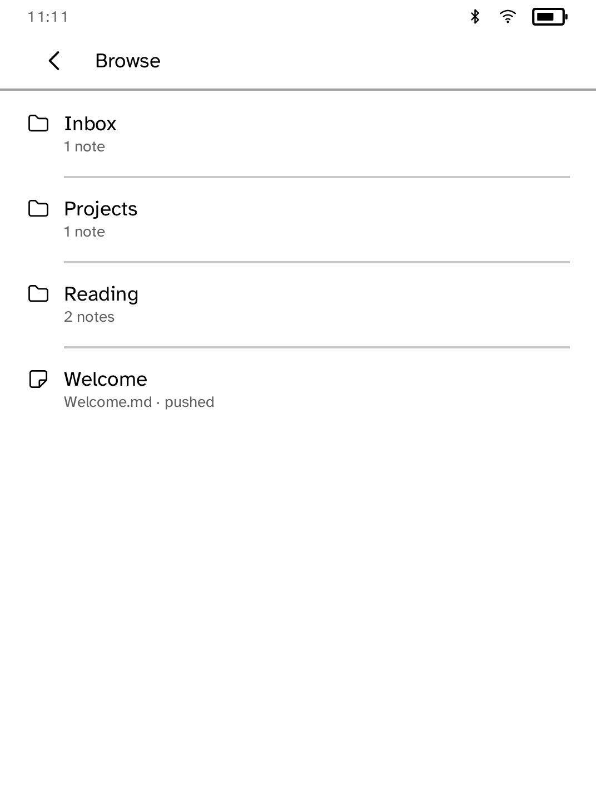
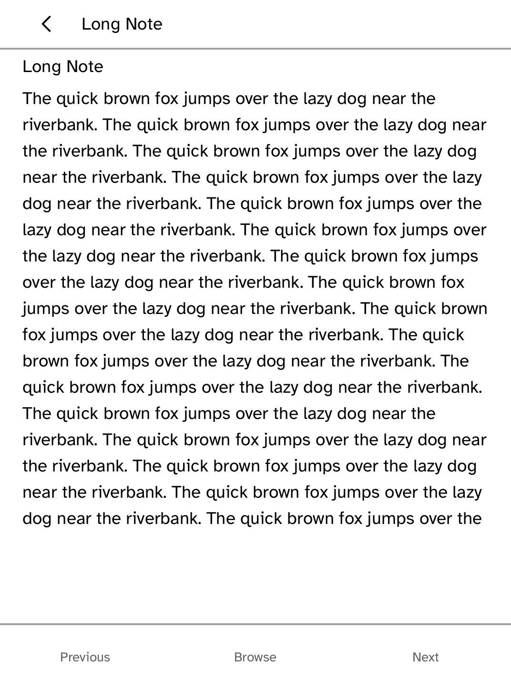
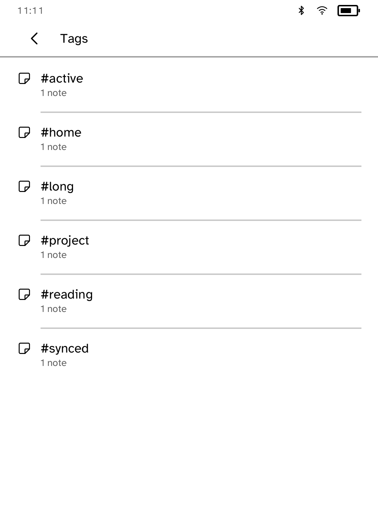
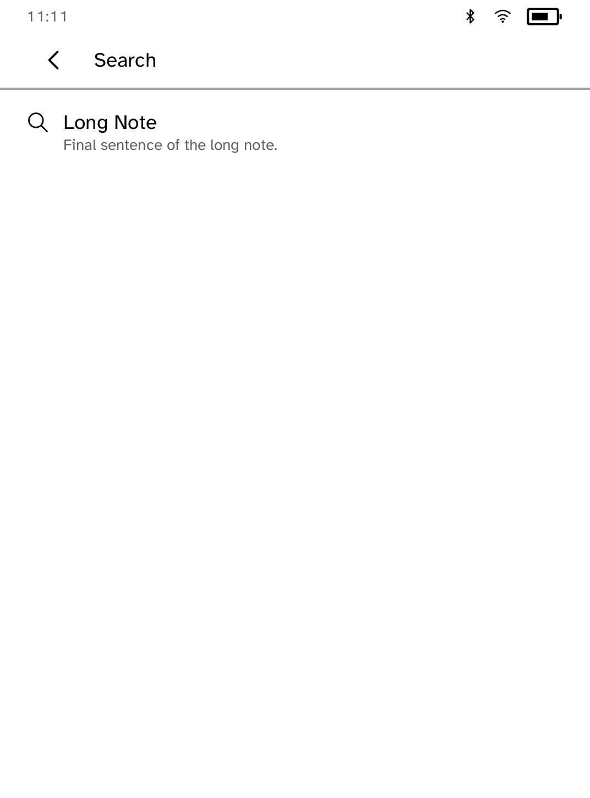

# Vault

A read-only, offline reader for Obsidian vaults. Push notes from a computer
with the companion CLI and they arrive as an indexed shelf: folders to drill
into, tags to filter by, wiki-link backlinks, a search across every note body,
and a reading view that paginates long notes and reopens where you left off.
It is unofficial and not affiliated with Dynalist Inc.; the UI is named
simply **Vault**.

```sh
kobo vault init --device 192.168.1.42
kobo vault push ~/Notes --device 192.168.1.42
```

For the simulator, push the same folder into the shelf the app reads:

```sh
kobo vault init --sim
kobo vault push ~/Notes --sim
```

Folders a sync tool drops into the reader's sync root are packed onto a
separate synced shelf with `kobo vault ingest DIR`; those notes appear
alongside pushed ones with their source labeled. Pushing is one-way from the
computer: notes written or edited on the reader stay on the reader, and the
next push or ingest replaces its shelf.

Readers still on the previous Vault app are not stranded: every push also
rewrites the packed index that app reads, until a vault grows past what that
index can hold.








## Dependencies

The app quarantines `pulldown-cmark` (MIT) in `src/md.rs` and sends its HTML
through Cobalt's `kobo-html` renderer, measured against the note ceiling so a
long note reaches its final sentence. Wiki links (`[[Note]]` and
`[[Note|label]]`) render as their visible text and build the per-note
backlinks view. The shelf codec in `src/shelf.rs` decodes the manifest the
`kobo vault` companion writes; the previous packed index in the app store
still opens, so a vault pushed by an older CLI keeps working.
