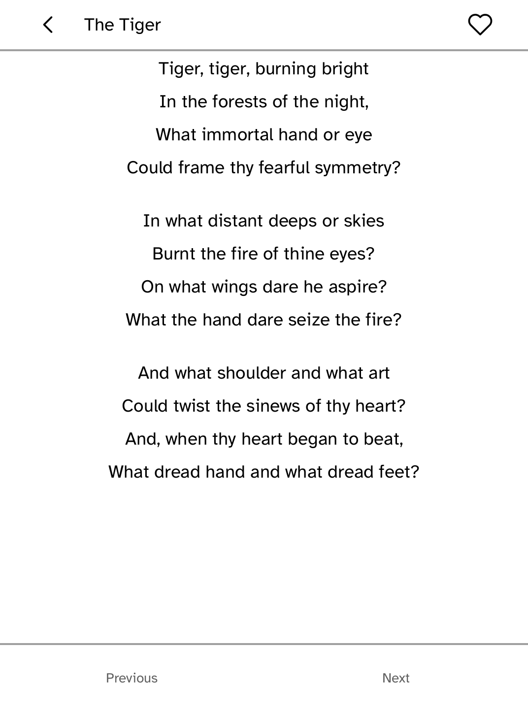
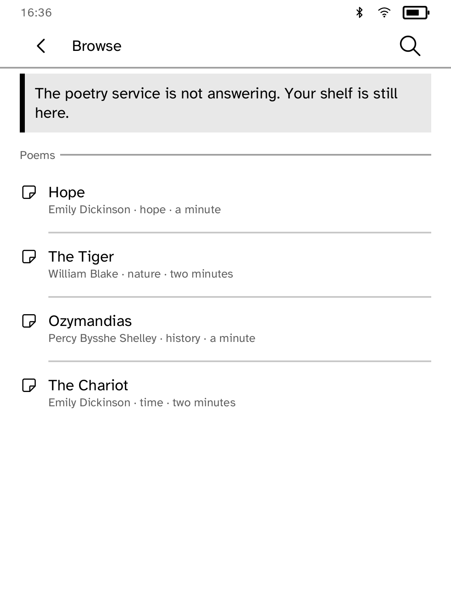

# Verses

One public-domain poem each day, typeset as a reading page.

The offline shelf keeps its provenance with every poem: author, first
publication year, and source. Search covers PoetryDB by title, poet, and lines,
and found poems can be kept with the offline favorites. Translations are
included only when the translation itself is public domain.
