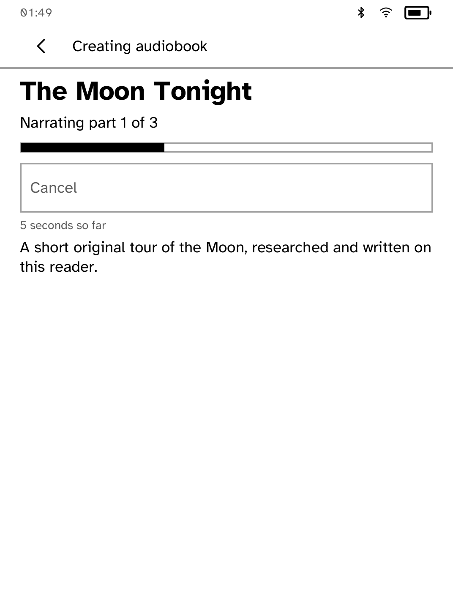

# Audiobook Studio

Type a topic and the application asks Exa for deep research, OpenAI for an
original spoken script, and ElevenLabs for narration. It packages the bounded
MP3 parts as a Kobo `.mp3z` in `/mnt/onboard/Audiobooks`, so the result remains
available in My Books.

The finished result opens in `kobo_sdk::audio::AudioPlayer` with deterministic
album art, position, ±30-second seek, play/pause and software volume. Playback
uses a connected Bluetooth audio-class device. If none is connected, Play
opens the component's own headphones/speaker picker; after pairing and
connection the pending audiobook starts automatically.

Provider keys remain runtime secrets named `exa`, `openai` and `elevenlabs`.
They are attached only to the exact provider endpoints allowed by `kobod` and
are never sent to, stored by, or logged from the application process.

| The shelf, before anything exists | What a missing account costs |
| --- | --- |
|  |  |

| Making it | Picking up where it stopped |
| --- | --- |
|  |  |

| Listening |
| --- |
|  |

*Captured by `scripts/quality/check-audiobook-sim.py` on the simulator's Clara
BW profile, end to end against local fixtures that record every provider
request.*

## The shelf

The application opens on what it has already made, not on the form. An
audiobook is four minutes of somebody else's money and a few minutes of
waiting, so the copy that exists is worth more than the copy that does not.

Two things store it. The `.mp3z` itself goes to `/mnt/onboard/Audiobooks`,
which is where the reader's own My Books looks, and is published by rename so a
power cut during a save leaves the previous state, never a truncated file.
The titles go to the application's own store, because the shelf can only key on
a slug and `a-string-into-the-sky-the-story-and-science-of-k` is not a title.

The shelf remains the truth about what exists. The index only supplies the
words and the order, and a line it cannot parse is skipped,
so a corrupt index costs you a title and not a library.

Nothing here needs the network. A book made last week opens and plays with
Wi-Fi off, which is the point of putting it on the reader rather than streaming
it.

## Why it says how long it has been

Research is about ten seconds, the script is around a hundred, and narration is
a dozen or so calls. A progress bar that sits at thirty percent for a minute
and a half is indistinguishable from a hung application, and on a panel that
does not animate there is nothing else to say otherwise.

So a `Heartbeat` ticks every five seconds and the screen counts up: "25 seconds
so far", then "2 min 45 s so far". It is the cheapest possible proof that the
application is still alive, and it costs one nap.

The save has its own bar in bytes, because that is the one stage whose progress
is genuinely known rather than estimated.

## Running it

```sh
kobo secret set exa        --from PATH --device IP
kobo secret set openai     --from PATH --device IP
kobo secret set elevenlabs --from PATH --device IP
```

All three are needed, and the application checks them before the first paid
request and names any that are missing, instead of failing at the end with
everything already spent. Without any of them the free sample still plays, so
the player can be tried before an account exists.

---

Built with the [Cobalt SDK](../../README.md), which
[installs on a Kobo](../../README.md#install-it-on-your-kobo) with one
command over USB. The other apps:
[Launcher](../launcher/README.md) ·
[Gutenbird](../gutenbird/README.md) ·
[Hacker News](../hn/README.md) ·
[RSS Reader](../rss/README.md) ·
[Daily Brief](../brief/README.md) ·
[AI Chat](../chat/README.md) ·
[Coding Agents Sidekick](../sidekick/README.md) ·
[Terminal](../terminal/README.md) ·
[UI Components Showcase](../gallery/README.md) ·
[Settings](../settings/README.md) ·
[Todo](../todo/README.md) ·
[Tic-tac-toe](../tictactoe/README.md) ·
[Magnet Sensor](../magnet/README.md)
