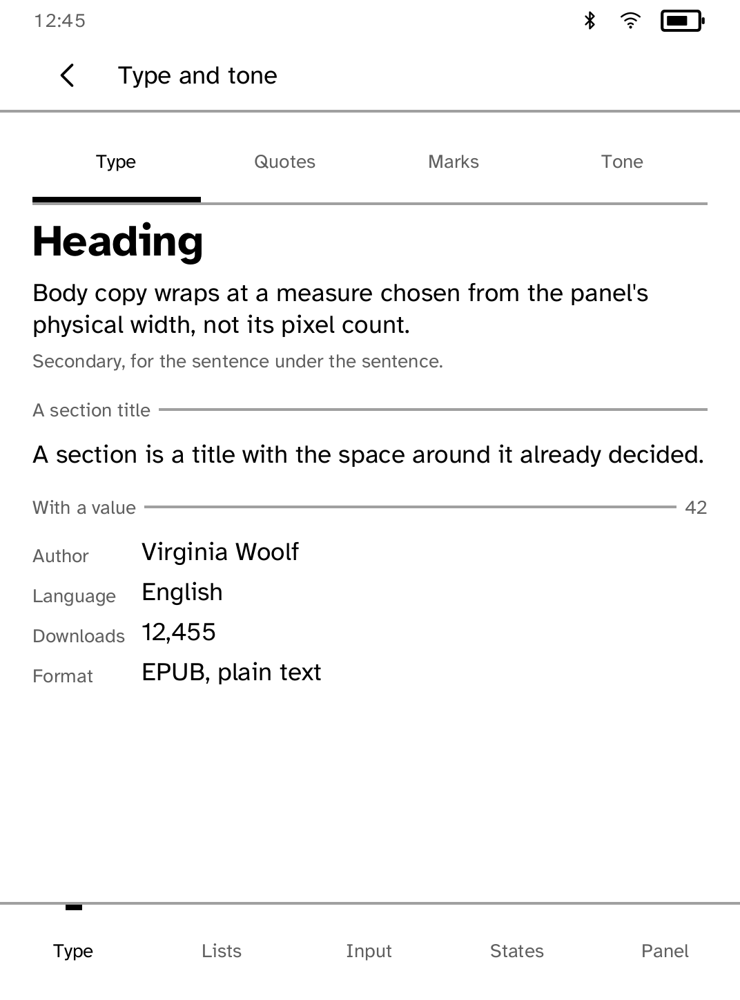
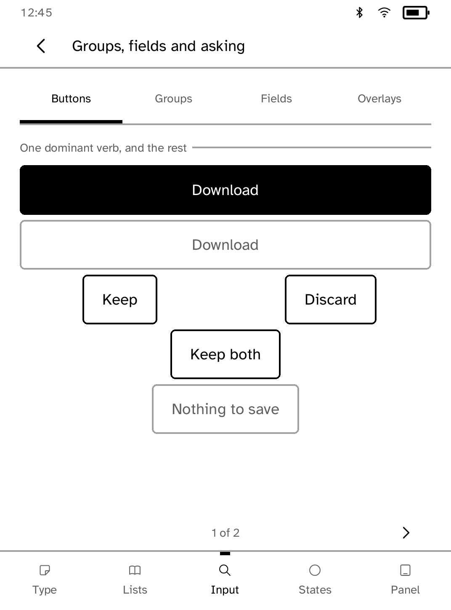

# Components

Every Cobalt interface component on one device, for checking by eye.

<table>
<tr>
<td width="50%" valign="top"><br>Headings, text, rules and facts</td>
<td width="50%" valign="top"><br>Buttons, from the one primary action down</td>
</tr>
</table>

## What it covers

- Every node in `kobo-ui` appears here. A new component should be added to the
  gallery when it is added to the SDK.
- The **Panel** tab shows the Folio components: masthead, card tiles, section
  links, page rail and navigation.
- The App Store card on the Panel tab walks through one task end to end:
  choosing a book, confirming it, downloading it and opening it.
- Pages are split by measurement, so every page fits every supported screen at
  every text size. A test lays out every page on all eight supported screens
  at all nine text sizes.
- The gallery triggers two layout warnings on purpose: the tone budget on the
  launcher-style shelf, and two primary actions on the buttons page. Any other
  warning fails the tests.

`kobo drive` can tap through the tabs and capture each one, so a change to the
layout engine can be compared as pictures.

## Permissions

- `network`: used by the activity and cancellation example, which starts a real request.

## Development

```sh
cargo test -p kobo-gallery
kobo run --sim --app gallery      # in the browser simulator
python3 scripts/check-apps-sim.py gallery
kobo deploy --device <ip>       # onto a reader over Wi-Fi
```

---

Part of [Cobalt](../../README.md). See [all apps](../../README.md#apps).
