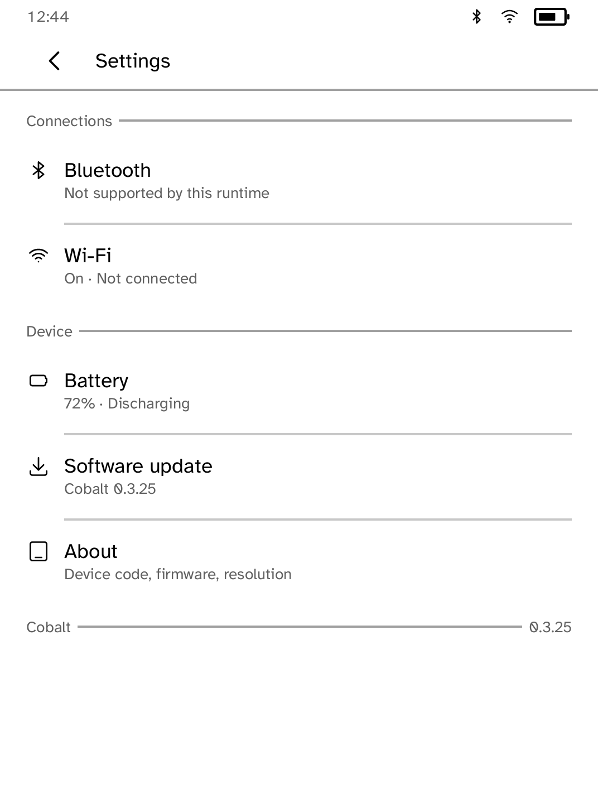
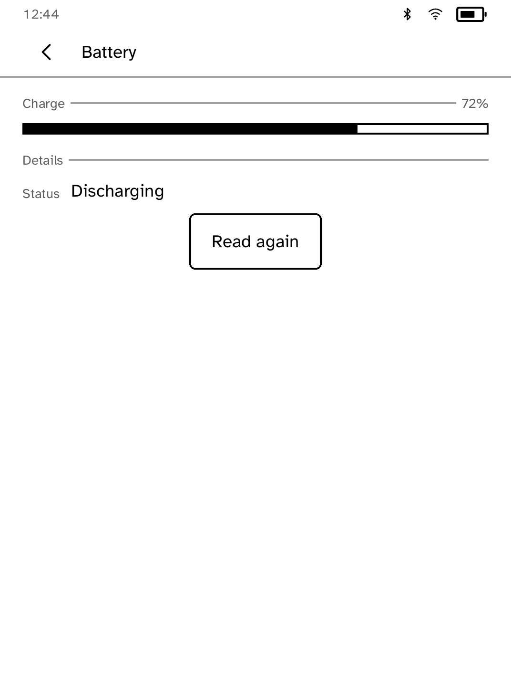
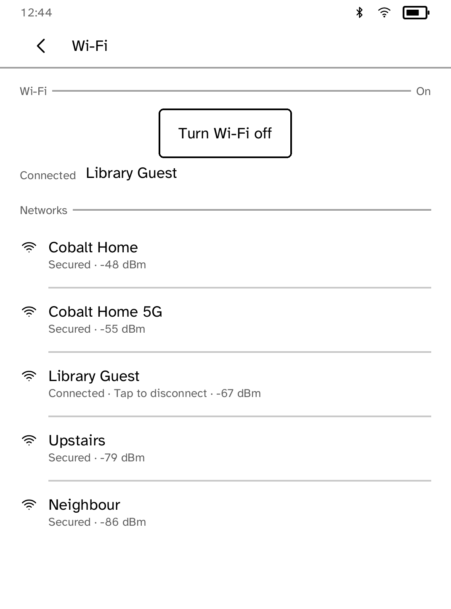

# Settings

Wi-Fi, Bluetooth, battery details and Cobalt updates.

<table>
<tr>
<td width="50%" valign="top"><br>Connections, each with its current state</td>
<td width="50%" valign="top"><br>Battery details</td>
</tr>
<tr>
<td width="50%" valign="top"><br>Wi-Fi networks in range, with the one joined</td>
</tr>
</table>

## Features

- Each row shows its state, such as **Wi-Fi: Connected** or **Battery: 95%,
  discharging**, so you can check at a glance.
- **Wi-Fi**: turn the radio on or off, scan, join and disconnect. Disconnecting
  ends any session that reaches the reader over Wi-Fi.
- **Bluetooth**: scan for devices and connect to them by name. When
  Bluetooth is off, the screen says so rather than showing an empty list.
- **Battery**: charge, status and time remaining, plus capacity, chemistry,
  temperature, voltage, current and charge figures from the fuel gauge.
  **Read again** refreshes them.
- **Software update**: checks for and installs Cobalt updates, and switches
  between the Stable and Beta channels.

Brightness, time zone, accounts and firmware stay in the Kobo's own settings.

## Development

```sh
cargo test -p kobo-settings
kobo run --sim --app settings      # in the browser simulator
kobo deploy --device <ip>       # onto a reader over Wi-Fi
```
Network names in the screenshots are hidden with `scripts/redact-ssids.py`.

---

Part of [Cobalt](../../README.md). See [all apps](../../README.md#apps).
