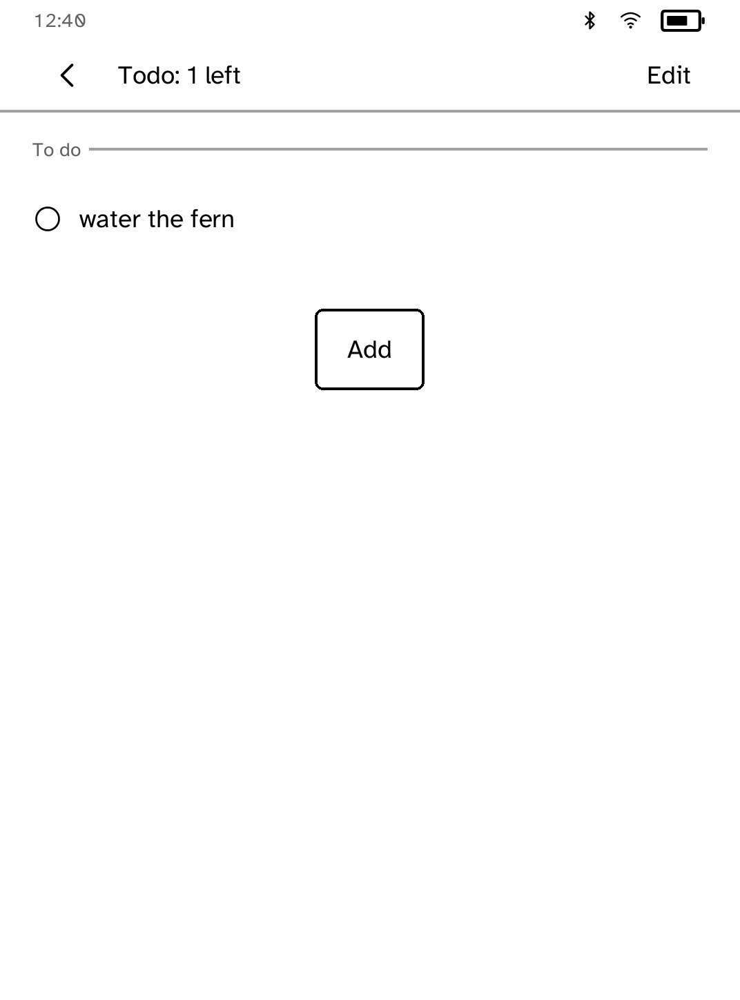
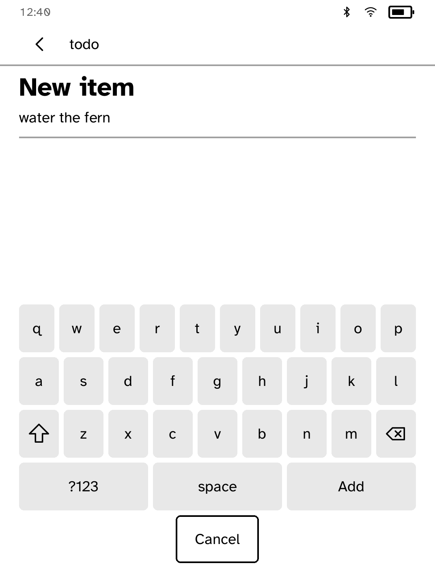

# Todo

A simple to-do list that stays on your Kobo.

<table>
<tr>
<td width="50%" valign="top"><br>The list, with an item still to do</td>
<td width="50%" valign="top"><br>Adding an item</td>
</tr>
</table>

## Features

- Add items, tap to tick them off, and clear finished items. Clearing can be
  undone until the next change.
- Add `#tags` to items and filter by them with the chips above the list.
- **Edit** opens the full list. Tap an item to rename it, move it, give it a
  due date or remove it. Dates read as "due tomorrow" or "3 days late".
- **Save a copy** sends the list to a paired computer as plain text.
- Every change is saved immediately, so closing the cover or a flat battery
  loses nothing. Only the tapped row redraws.

## Permissions

None.

## Development

```sh
cargo test -p kobo-todo
kobo run --sim --app todo      # in the browser simulator
python3 scripts/check-apps-sim.py todo
kobo deploy --device <ip>       # onto a reader over Wi-Fi
```

---

Part of [Cobalt](../../README.md). See [all apps](../../README.md#apps).
